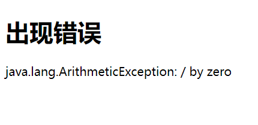

# 一、SpringMVC简介

## 1、什么是MVC
- MVC是一种软件架构的思想，将软件按照<font color="red">模型、视图、控制器</font>来划分
1. <font color="red">M：Model</font>，<font color="blue">模型层</font>，指工程中的JavaBean，作用是处理数据，JavaBean分为两类：
   1. 一类称为实体类Bean：专门存储业务数据的，如 Student、User 等
   2. 一类称为业务处理 Bean：指 Service 或 Dao 对象，专门用于处理业务逻辑和数据访问。
2. <font color="red">V：View</font>，<font color="blue">视图层</font>，指工程中的html或jsp等页面，作用是与用户进行交互，展示数据
3. <font color="red">C：Controller</font>，<font color="blue">控制层</font>，指工程中的servlet，作用是接收请求和响应浏览器
4. <font color="red">MVC的工作流程</font>： 用户通过视图层发送请求到服务器，在服务器中请求被Controller接收，Controller调用相应的Model层处理请求，处理完毕将结果返回到Controller，Controller再根据请求处理的结果找到相应的View视图，渲染数据后最终响应给浏览器


## 2、什么是SpringMVC
1. SpringMVC是Spring的一个后续产品，是Spring的一个子项目
2. SpringMVC 是 Spring 为表述层开发提供的一整套完备的解决方案。在表述层框架历经 Strust、WebWork、Strust2 等诸多产品的历代更迭之后，目前业界普遍选择了 SpringMVC 作为 Java EE 项目表述层开发的<font color="red">首选方案</font>。
3. 注：三层架构分为表述层（或表示层）、业务逻辑层、数据访问层，表述层表示前台页面和后台 servlet


## 3、SpringMVC的特点
1. <font color="red">Spring 家族原生产品</font>，与 IOC 容器等基础设施无缝对接
2. <font color="red">基于原生的Servlet</font>，通过了功能强大的<font color="red">前端控制器DispatcherServlet</font>，对请求和响应进行统一处理
3. 表述层各细分领域需要解决的问题<font color="red">全方位覆盖</font>，提供<font color="red">全面解决方案</font>
4. <font color="red">代码清新简洁</font>，大幅度提升开发效率
5. 内部组件化程度高，可插拔式组件<font color="red">即插即用</font>，想要什么功能配置相应组件即可
6. <font color="red">性能卓著</font>，尤其适合现代大型、超大型互联网项目要求


# 二、HelloWorld

## 1、开发环境
- IDE：idea 2020.1.2
- 构建工具：maven3.6.3
- 服务器：tomcat8
- Spring版本：5.3.1


## 2、创建maven工程
1. 创建maven工程


2. 添加web模块


3. 打包方式：war
```xml
    <?xml version="1.0" encoding="UTF-8"?>
    <project xmlns="http://maven.apache.org/POM/4.0.0"
            xmlns:xsi="http://www.w3.org/2001/XMLSchema-instance"
            xsi:schemaLocation="http://maven.apache.org/POM/4.0.0 http://maven.apache.org/xsd/maven-4.0.0.xsd">
        <modelVersion>4.0.0</modelVersion>

        <groupId>com.yuehai.mvc</groupId>
        <artifactId>08_SpringMVC</artifactId>
        <version>1.0-SNAPSHOT</version>
        <!-- 表明打包方式为 war -->
        <packaging>war</packaging>
        
    </project>
```
4. 引入依赖，在 pom.xml 文件中
```xml
    <dependencies>
        <!-- SpringMVC -->
        <dependency>
            <groupId>org.springframework</groupId>
            <artifactId>spring-webmvc</artifactId>
            <version>5.3.1</version>
        </dependency>

        <!-- 日志 -->
        <dependency>
            <groupId>ch.qos.logback</groupId>
            <artifactId>logback-classic</artifactId>
            <version>1.2.3</version>
        </dependency>

        <!-- ServletAPI -->
        <dependency>
            <groupId>javax.servlet</groupId>
            <artifactId>javax.servlet-api</artifactId>
            <version>3.1.0</version>
            <scope>provided</scope>
        </dependency>

        <!-- Spring5和Thymeleaf整合包 -->
        <dependency>
            <groupId>org.thymeleaf</groupId>
            <artifactId>thymeleaf-spring5</artifactId>
            <version>3.0.12.RELEASE</version>
            </dependency>
    </dependencies>
```
- 注：由于 Maven 的传递性，我们不必将所有需要的包全部配置依赖，而是配置最顶端的依赖，其他靠传递性导入。


## 3、配置web.xml
- 注册SpringMVC的前端控制器DispatcherServlet
1. 默认配置方式
   - 此配置作用下，SpringMVC的配置文件默认位于WEB-INF下，默认名称为< servlet-name >-servlet.xml，例如，以下配置所对应SpringMVC的配置文件位于WEB-INF下，文件名为springMVC-servlet.xml
```xml
    <?xml version="1.0" encoding="UTF-8"?>
    <web-app xmlns="http://xmlns.jcp.org/xml/ns/javaee"
            xmlns:xsi="http://www.w3.org/2001/XMLSchema-instance"
            xsi:schemaLocation="http://xmlns.jcp.org/xml/ns/javaee http://xmlns.jcp.org/xml/ns/javaee/web-app_4_0.xsd"
            version="4.0">

        <!-- 配置SpringMVC的前端控制器，对浏览器发送的请求统一进行处理 -->
        <servlet>
            <servlet-name>springMVC</servlet-name>
            <servlet-class>org.springframework.web.servlet.DispatcherServlet</servlet-class>
        </servlet>
        <servlet-mapping>
            <servlet-name>springMVC</servlet-name>
            <!--
                设置springMVC的核心控制器所能处理的请求的请求路径
                /：所匹配的请求可以是/login或.html或.js或.css方式的请求路径
                但是 / 不能匹配.jsp请求路径的请求
            -->
            <url-pattern>/</url-pattern>
        </servlet-mapping>
        
    </web-app>
```
2. 扩展配置方式（<font color="red">一般使用</font>）
   - 可通过init-param标签设置SpringMVC配置文件的位置和名称，通过load-on-startup标签设置SpringMVC前端控制器DispatcherServlet的初始化时间
```xml
    <?xml version="1.0" encoding="UTF-8"?>
    <web-app xmlns="http://xmlns.jcp.org/xml/ns/javaee"
            xmlns:xsi="http://www.w3.org/2001/XMLSchema-instance"
            xsi:schemaLocation="http://xmlns.jcp.org/xml/ns/javaee http://xmlns.jcp.org/xml/ns/javaee/web-app_4_0.xsd"
            version="4.0">

        <!-- 配置SpringMVC的前端控制器，对浏览器发送的请求统一进行处理 -->
        <servlet>
            <servlet-name>springMVC</servlet-name>
            <servlet-class>org.springframework.web.servlet.DispatcherServlet</servlet-class>
            <!-- 通过初始化参数指定SpringMVC配置文件的位置和名称 -->
            <init-param>
                <!-- contextConfigLocation为固定值 -->
                <param-name>contextConfigLocation</param-name>
                <!-- 使用classpath:表示从类路径查找配置文件，例如maven工程中的src/main/resources -->
                <param-value>classpath:springMVC.xml</param-value>
            </init-param>
            <!--作为框架的核心组件，在启动过程中有大量的初始化操作要做
                而这些操作放在第一次请求时才执行会严重影响访问速度
                因此需要通过此标签将启动控制DispatcherServlet的初始化时间提前到服务器启动时-->
            <load-on-startup>1</load-on-startup>
        </servlet>
        <servlet-mapping>
            <servlet-name>springMVC</servlet-name>
            <!--设置springMVC的核心控制器所能处理的请求的请求路径
                /：所匹配的请求可以是/login或.html或.js或.css方式的请求路径
                但是 / 不能匹配.jsp请求路径的请求-->
            <url-pattern>/</url-pattern>
        </servlet-mapping>
        
    </web-app>
```
3. 创建 sprngmvc 配置文件


4. 注：< url-pattern >标签中使用/和/*的区别：
   1. /所匹配的请求可以是/login或.html或.js或.css方式的请求路径，但是/不能匹配.jsp请求路径的请求，因此就可以避免在访问jsp页面时，该请求被DispatcherServlet处理，从而找不到相应的页面
   2. /*则能够匹配所有请求，例如在使用过滤器时，若需要对所有请求进行过滤，就需要使用/*的写法


## 4、创建请求控制器
1. 由于前端控制器对浏览器发送的请求进行了统一的处理，但是具体的请求有不同的处理过程，因此需要创建处理具体请求的类，即请求控制器
2. 请求控制器中每一个处理请求的方法成为控制器方法
3. 因为SpringMVC的控制器由一个POJO（普通的Java类）担任，因此需要通过@Controller注解将其标识为一个控制层组件，交给Spring的IoC容器管理，此时SpringMVC才能够识别控制器的存在
```java
    // @Controller注解，标识该类为控制器
    @Controller
    public class HelloController {
        
    }
```


## 5、创建springMVC的配置文件
```xml
    <?xml version="1.0" encoding="UTF-8"?>
    <beans xmlns="http://www.springframework.org/schema/beans"
        xmlns:xsi="http://www.w3.org/2001/XMLSchema-instance"
        xmlns:context="http://www.springframework.org/schema/context"
        xmlns:mvc="http://www.springframework.org/schema/mvc"
        xsi:schemaLocation="http://www.springframework.org/schema/beans
                            http://www.springframework.org/schema/beans/spring-beans.xsd
                            http://www.springframework.org/schema/context
                            https://www.springframework.org/schema/context/spring-context.xsd
                            http://www.springframework.org/schema/mvc
                            https://www.springframework.org/schema/mvc/spring-mvc.xsd">

        <!-- 自动扫描包 -->
        <context:component-scan base-package="com.yuehai.mvc.controller" />

        <!-- 配置Thymeleaf视图解析器 -->
        <bean id="viewResolver" class="org.thymeleaf.spring5.view.ThymeleafViewResolver">
            <!-- 设置试图解析器的优先级 -->
            <property name="order" value="1" />
            <!-- 解析视图时所用的编码 -->
            <property name="characterEncoding" value="UTF-8" />
            <!-- 当前所用的模板 -->
            <property name="templateEngine">
                <!-- 配置模板，这个内部 bean 为上一个属性 templateEngine 赋值 -->
                <bean class="org.thymeleaf.spring5.SpringTemplateEngine">
                    <!-- 解析视图的策略 -->
                    <property name="templateResolver">
                        <!-- 配置解析视图的策略，这个内部 bean 为上一个属性 templateResolver 赋值 -->
                        <bean class="org.thymeleaf.spring5.templateresolver.SpringResourceTemplateResolver">
                            <!-- 视图前缀 -->
                            <property name="prefix" value="/WEB-INF/templates/" />
                            <!-- 视图后缀 -->
                            <property name="suffix" value=".html" />
                            <!-- 使用的模板的模型 -->
                            <property name="templateMode" value="HTML5" />
                            <!-- 页面中使用的编码 -->
                            <property name="characterEncoding" value="UTF-8" />
                        </bean>
                    </property>
                </bean>
            </property>
        </bean>

        <!-- 开启mvc注解驱动 -->
        <mvc:annotation-driven>
            <mvc:message-converters>
                <!-- 处理响应中文内容乱码 -->
                <bean class="org.springframework.http.converter.StringHttpMessageConverter">
                    <property name="defaultCharset" value="UTF-8" />
                    <property name="supportedMediaTypes">
                        <list>
                            <value>text/html</value>
                            <value>application/json</value>
                        </list>
                    </property>
                </bean>
            </mvc:message-converters>
        </mvc:annotation-driven>

    </beans>
```


## 6、测试HelloWorld
- 当前项目结构


1. 实现对首页的访问
```java
    // @Controller注解，标识该类为控制器
    @Controller
    public class HelloController {

        /**
        * @RequestMapping注解：处理请求和控制器方法之间的映射关系
        * @RequestMapping注解的value属性可以通过请求地址匹配请求，
        * / 表示的当前工程的上下文路径，localhost:8080/springMVC/
        * @return  设置视图名称
        */
        @RequestMapping("/")
        public String index() {
            // 设置返回（进入）的视图的名称，前缀与后缀已在配置文件中配置
            return "index";
        }

    }
```
2. 通过超链接跳转到指定页面
   1. 在主页index.html中设置超链接
   ```html
        <!DOCTYPE html>
        <html lang="zh_CN" xmlns:th="http://www.thymeleaf.org">
        <head>
            <meta charset="UTF-8">
            <title>首页</title>
        </head>
        <body>
        <h1>首页</h1>
        <!-- 路径使用 / 代表是绝对路径，是：http://localhost:8080/工程名/ -->
        <!-- @{/target}：请求地址，使用控制器中注解为 @RequestMapping("/target") 的方法 -->
        <a th:href="@{/target}">访问目标页面：target.html</a><br/>
        </body>
        </html>
   ```
   2. 在请求控制器中创建处理请求的方法
   ```java
        @RequestMapping("/target")
        public String totarget(){
            // 设置返回（进入）的视图的名称
            return "target";
        }
   ```


## 7、总结
- 浏览器发送请求，若请求地址符合前端控制器的url-pattern，该请求就会被前端控制器DispatcherServlet处理。前端控制器会读取SpringMVC的核心配置文件，通过扫描组件找到控制器，将请求地址和控制器中@RequestMapping注解的value属性值进行匹配，若匹配成功，该注解所标识的控制器方法就是处理请求的方法。处理请求的方法需要返回一个字符串类型的视图名称，该视图名称会被视图解析器解析，加上前缀和后缀组成视图的路径，通过Thymeleaf对视图进行渲染，最终转发到视图所对应页面


# 三、@RequestMapping注解

## 1、@RequestMapping注解的功能
1. 从注解名称上我们可以看到，@RequestMapping注解的作用就是将请求和处理请求的控制器方法关联起来，建立映射关系。
2. SpringMVC 接收到指定的请求，就会来找到在映射关系中对应的控制器方法来处理这个请求。


## 2、@RequestMapping注解的位置
1. @RequestMapping标识一个类：设置映射请求的请求路径的初始（全局初始）信息
2. @RequestMapping标识一个方法：设置映射请求请求路径的具体信息
```java
    // @Controller注解，标识该类为控制器
    @Controller
    @RequestMapping("/yuehai")
    public class TestController {

        /**
        * @RequestMapping注解：处理请求和控制器方法之间的映射关系
        * @RequestMapping注解的value属性可以通过请求地址匹配请求，
        * / 表示的当前工程的上下文路径，localhost:8080/springMVC/
        * @return  设置视图名称
        */
        // 此时请求映射所映射的请求的请求路径为：/yuehai/
        @RequestMapping("/")
        public String index() {
            // 设置返回（进入）的视图的名称，前缀与后缀已在配置文件中配置
            return "index";
        }

        // 此时请求映射所映射的请求的请求路径为：/yuehai/target
        @RequestMapping("/target")
        public String totarget(){
            // 设置返回（进入）的视图的名称
            return "target";
        }
    }
```


## 3、@RequestMapping注解的value属性
1. @RequestMapping注解的value属性通过请求的请求地址匹配请求映射
2. @RequestMapping注解的value属性是一个字符串类型的数组，表示该请求映射能够匹配多个请求地址所对应的请求
3. @RequestMapping注解的value属性必须设置，至少通过请求地址匹配请求映射
4. TestController 控制器
```java
    // @Controller注解，标识该类为控制器
    @Controller
    public class TestController {

        /**
        * @RequestMapping注解：处理请求和控制器方法之间的映射关系
        * @RequestMapping注解的value属性可以通过请求地址匹配请求，
        * / 表示的当前工程的上下文路径，localhost:8080/springMVC/
        * @return  设置视图名称
        */
        @RequestMapping("/")
        public String index() {
            // 设置返回（进入）的视图的名称，前缀与后缀已在配置文件中配置
            return "index";
        }

        /**
        * @RequestMapping注解的value属性是一个字符串类型的数组
        * 请求地址中只要满足其中一个就可以
        */
        @RequestMapping(
                value = {"/testRequestMapping","/test"}
        )
        public String totestRequestMapping(){
            // 设置返回（进入）的视图的名称
            return "testRequestMapping";
        }
    }
```
5. index.html
```html
    <!DOCTYPE html>
    <html lang="zh_CN" xmlns:th="http://www.thymeleaf.org">
    <head>
        <meta charset="UTF-8">
        <title>首页</title>
    </head>
    <body>
    <h1>首页</h1>
    <!-- 路径使用 / 代表是绝对路径，是：http://localhost:8080/工程名/ -->
    <!-- @{/target}：请求地址，使用控制器中注解为 @RequestMapping("/target") 的方法 -->
    <a th:href="@{/target}">访问目标页面：target.html</a><br/>
    <a th:href="@{/testRequestMapping}">访问目标页面：testRequestMapping.html，请求地址为：/testRequestMapping</a><br/>
    <a th:href="@{/test}">访问目标页面：testRequestMapping.html，请求地址为：/test</a><br/>
    </body>
    </html>
```


## 4、@RequestMapping注解的method属性
1. @RequestMapping注解的method属性通过请求的请求方式（get或post）匹配请求映射
2. @RequestMapping注解的method属性是一个RequestMethod类型的数组，表示该请求映射能够匹配多种请求方式的请求
3. 若当前请求的请求地址满足请求映射的value属性，但是请求方式不满足method属性，则浏览器报错405：Request method 'POST' not supported
4. 不设置 method 属性则默认为 任何的请求都可以匹配
5. TestController 控制器
```java
    // @Controller注解，标识该类为控制器
@Controller
public class TestController {

    /**
     * @RequestMapping注解：处理请求和控制器方法之间的映射关系
     * @RequestMapping注解的value属性可以通过请求地址匹配请求，
     * / 表示的当前工程的上下文路径，localhost:8080/springMVC/
     * @return  设置视图名称
     */
    @RequestMapping("/")
    public String index() {
        // 设置返回（进入）的视图的名称，前缀与后缀已在配置文件中配置
        return "index";
    }

    /**
     * @RequestMapping注解的value属性是一个字符串类型的数组
     * 请求地址中只要满足其中一个就可以
     */
    @RequestMapping(
            value = {"/testRequestMapping","/test"},
            method = {RequestMethod.GET,RequestMethod.POST}
    )
    public String totestRequestMapping(){
        // 设置返回（进入）的视图的名称
        return "testRequestMapping";
    }
}
```
6. index.html
```html
    <!DOCTYPE html>
    <html lang="zh_CN" xmlns:th="http://www.thymeleaf.org">
    <head>
        <meta charset="UTF-8">
        <title>首页</title>
    </head>
    <body>
    <h1>首页</h1>
    <!-- 路径使用 / 代表是绝对路径，是：http://localhost:8080/工程名/ -->
    <!-- @{/target}：请求地址，使用控制器中注解为 @RequestMapping("/target") 的方法 -->
    <a th:href="@{/target}">访问目标页面：target.html</a><br/>
    <a th:href="@{/testRequestMapping}">访问目标页面：testRequestMapping.html，请求地址为：/testRequestMapping</a><br/>
    <a th:href="@{/test}">访问目标页面：testRequestMapping.html，请求地址为：/test</a><br/>
    <form th:action="@{/testRequestMapping}" method="post">
        <input type="submit">
    </form>
    </body>
    </html>
```
---
注：
1. 对于处理指定请求方式的控制器方法，SpringMVC中提供了@RequestMapping的派生注解
   1. 处理get请求的映射-->@GetMapping
   2. 处理post请求的映射-->@PostMapping
   3. 处理put请求的映射-->@PutMapping
   4. 处理delete请求的映射-->@DeleteMapping
2. 常用的请求方式有get，post，put，delete
   1. 但是目前浏览器只支持get和post，若在form表单提交时，为method设置了其他请求方式的字符串（put或delete），则按照<font color="red">默认的请求方式get处理</font>
   2. 若要发送put和delete请求，则需要通过spring提供的过滤器HiddenHttpMethodFilter，在RESTful部分会讲到
```html
    <form th:action="@{/testRequestMapping}" method="put">
        <input type="submit" value="测试form表单是否能够发送put或delete请求">
    </form>
```


## 5、@RequestMapping注解的params属性（了解）
1. @RequestMapping注解的params属性通过请求的请求参数匹配请求映射
2. @RequestMapping注解的params属性是一个字符串类型的数组，可以通过四种表达式设置请求参数和请求映射的匹配关系
   1. "param"：要求请求映射所匹配的请求必须携带param请求参数
   2. "!param"：要求请求映射所匹配的请求必须不能携带param请求参数
   3. "param=value"：要求请求映射所匹配的请求必须携带param请求参数且param=value
   4. "param!=value"：要求请求映射所匹配的请求必须携带param请求参数但是param!=value
3. 若当前请求满足@RequestMapping注解的value和method属性，但是不满足headers属性，此时页面显示404错误，即资源未找到
4. TestController 控制器
```java
    /**
     * @RequestMapping注解的属性：
     * value属性是一个字符串类型的数组，请求地址中只要满足其中一个就可以
     * method属性通过请求的请求方式（get或post）匹配请求映射
     * params属性通过请求的请求参数匹配请求映射
     */
    @RequestMapping(
            value = {"/testRequestMapping","/test"},
            method = {RequestMethod.GET,RequestMethod.POST},
            /**
             * "username"：请求参数必须携带username参数，有没有值无所谓
             * "!username"：请求参数不能携带username参数
             * username=admin：请求参数必须携带username参数，且值必须为admin
             * username!=admin：请求参数必须携带username参数，但是值不能为admin
            */
            params = {"username=admin"}
    )
    public String totestRequestMapping(){
        // 设置返回（进入）的视图的名称
        return "testRequestMapping";
    }
```
4. index.html
```html
    <form th:action="@{/testRequestMapping}" method="get">
        <input type="text" name="username">
        <input type="submit" value="测试RequestMapping注解的params属性">
    </form>
```


## 6、@RequestMapping注解的headers属性（了解）
1. @RequestMapping注解的headers属性通过请求的请求头信息匹配请求映射
2. @RequestMapping注解的headers属性是一个字符串类型的数组，可以通过四种表达式设置请求头信息和请求映射的匹配关系
   1. "header"：要求请求映射所匹配的请求必须携带header请求头信息
   2. "!header"：要求请求映射所匹配的请求必须不能携带header请求头信息
   3. "header=value"：要求请求映射所匹配的请求必须携带header请求头信息且header=value
   4. "header!=value"：要求请求映射所匹配的请求必须携带header请求头信息且header!=value
3. 若当前请求满足@RequestMapping注解的value和method属性，但是不满足headers属性，此时页面显示404错误，即资源未找到
4. 一般情况下的请求头：
```html
    Accept: text/html,application/xhtml+xml,application/xml;q=0.9,image/webp,image/apng,*/*;q=0.8,application/signed-exchange;v=b3;q=0.9
    Accept-Encoding: gzip, deflate, br
    Accept-Language: zh-CN,zh;q=0.9,en;q=0.8,en-GB;q=0.7,en-US;q=0.6
    Connection: keep-alive
    Cookie: Idea-184fc5d2=59f0c5fd-3b4e-417f-82cc-0daaabb2d12c
    Host: localhost:8080
    Referer: http://localhost:8080/02_RequestMapping/
    sec-ch-ua: " Not A;Brand";v="99", "Chromium";v="96", "Microsoft Edge";v="96"
    sec-ch-ua-mobile: ?0
    sec-ch-ua-platform: "Windows"
    Sec-Fetch-Dest: document
    Sec-Fetch-Mode: navigate
    Sec-Fetch-Site: same-origin
    Sec-Fetch-User: ?1
    Upgrade-Insecure-Requests: 1
    User-Agent: Mozilla/5.0 (Windows NT 10.0; Win64; x64) AppleWebKit/537.36 (KHTML, like Gecko) Chrome/96.0.4664.110 Safari/537.36 Edg/96.0.1054.62
```
5. TestController 控制器
```java
    // @Controller注解，标识该类为控制器
    @Controller
    public class TestController {

        /**
        * @RequestMapping注解：处理请求和控制器方法之间的映射关系
        * @RequestMapping注解的value属性可以通过请求地址匹配请求，
        * / 表示的当前工程的上下文路径，localhost:8080/springMVC/
        * @return  设置视图名称
        */
        @RequestMapping("/")
        public String index() {
            // 设置返回（进入）的视图的名称，前缀与后缀已在配置文件中配置
            return "index";
        }

        @RequestMapping("/target")
        public String totarget(){
            // 设置返回（进入）的视图的名称
            return "target";
        }

        /**
        * @RequestMapping注解的属性：
        * value属性是一个字符串类型的数组，请求地址中只要满足其中一个就可以
        * method属性通过请求的请求方式（get或post）匹配请求映射
        * params属性通过请求的请求参数匹配请求映射
        * headers属性通过请求的请求头信息匹配请求映射
        */
        @RequestMapping(
                value = {"/testRequestMapping","/test"},
                method = {RequestMethod.GET,RequestMethod.POST},
                /**
                * username：请求参数必须携带username参数，有没有值无所谓
                * !username：请求参数不能携带username参数
                * username=admin：请求参数必须携带username参数，且值必须为admin
                * username!=admin：请求参数必须携带username参数，但是值不能为admin
                */
                params = {"username=admin"},
                /**
                * "header"：要求请求映射所匹配的请求必须携带header请求头信息
                * "!header"：要求请求映射所匹配的请求必须不能携带header请求头信息
                * "header=value"：要求请求映射所匹配的请求必须携带header请求头信息且header=value
                * "header!=value"：要求请求映射所匹配的请求必须携带header请求头信息且header!=value
                */
                headers = {"accept","Host=localhost:8080"}
        )
        public String totestRequestMapping(){
            // 设置返回（进入）的视图的名称
            return "testRequestMapping";
        }
    }
```
6. index.html
```html
    <!DOCTYPE html>
    <html lang="zh_CN" xmlns:th="http://www.thymeleaf.org">
    <head>
        <meta charset="UTF-8">
        <title>首页</title>
    </head>
    <body>
    <h1>首页</h1>
    <!-- 路径使用 / 代表是绝对路径，是：http://localhost:8080/工程名/ -->
    <!-- @{/target}：请求地址，使用控制器中注解为 @RequestMapping("/target") 的方法 -->
    <a th:href="@{/target}">访问目标页面：target.html</a><br/>
    <a th:href="@{/testRequestMapping}">访问目标页面：testRequestMapping.html，请求地址为：/testRequestMapping</a><br/>
    <a th:href="@{/test}">访问目标页面：testRequestMapping.html，请求地址为：/test</a><br/>

    <form th:action="@{/testRequestMapping}" method="post">
        <input type="submit" value="测试RequestMapping注解的method属性">
    </form>

    <form th:action="@{/testRequestMapping}" method="put">
        <input type="submit" value="测试form表单是否能够发送put或delete请求">
    </form>

    <form th:action="@{/testRequestMapping}" method="get">
        <input type="text" name="username">
        <input type="submit" value="测试RequestMapping注解的params属性">
    </form>
    </body>
    </html>
```


## 7、SpringMVC支持ant风格的路径
1. ？：表示任意的单个字符
2. *：表示任意的0个或多个字符
3. **：表示任意的一层或多层目录
4. 注意：在使用 ** 时，只能使用/**/xxx的方式
5. TestController 控制器
```java
    // @RequestMapping("/target")
    @RequestMapping(value = {"/t?*","/**/t*"})
    public String totarget(){
        // 设置返回（进入）的视图的名称
        return "target";
    }
```
4. index.html
```html
    <a th:href="@{/ttrget}">访问目标页面：target.html，请求地址为：/t?rget</a>
    <a th:href="@{/t+-(!)x:xxx}">访问目标页面：target.html，请求地址为：/t?*</a>
    <a th:href="@{/a/s/d/f/g/h/j/t1b2n3n4m5}">访问目标页面：target.html，请求地址为：/**/t*</a>
```


## 8、SpringMVC支持路径中的占位符（<font color="red">重点</font>）
1. 原始方式：/deleteUser?id=1
2. rest方式：/deleteUser/1
3. SpringMVC路径中的占位符常用于RESTful风格中，当请求路径中将某些数据通过路径的方式传输到服务器中，就可以在相应的@RequestMapping注解的value属性中通过占位符{xxx}表示传输的数据，在通过@PathVariable注解，将占位符所表示的数据赋值给控制器方法的形参
4. 若是不在请求中给占位符，则此时页面显示404错误，即资源未找到
5. TestController 控制器
```java
    // SpringMVC支持路径中的占位符
    @RequestMapping("target2/{id}/{username}")
    // @PathVariable("id") String id：获取占位符请求参数中的id的值，并赋值给String类型的形参id
    public String totarget2(@PathVariable("id") String id,@PathVariable("username") String username){
        System.out.println("id：" + id + "，username：" + username);
        // 设置返回（进入）的视图的名称
        return "target";
    }
```
6. index.html
```html
    <a th:href="@{/target2/1/yuehai}">访问目标页面：target.html，测试路径中的占位符-->/totarget2</a>
```


# 四、SpringMVC获取请求参数

## 1、通过ServletAPI获取请求参数（不建议）
- 将HttpServletRequest作为控制器方法的形参，此时HttpServletRequest类型的参数表示封装了当前请求的请求报文的对象
1. TestController 控制器
```java
    // 通过ServletAPI获取请求参数
    @RequestMapping("/testServletAPI")
    // 形参位置的 request 标识当前请求
    public String testServletAPI(HttpServletRequest request){
        String username = request.getParameter("username");
        System.out.println(username);

        return "target";
    }
```
2. index.html
```html
    <!-- @{/testServletAPI(username='yuehai')}：thymeleaf中的url，()中的内容代表请求的参数 -->
    <a th:href="@{/target2/1/yuehai}">访问目标页面：target.html，测试路径中的占位符-->/totarget2</a>
```


## 2、通过控制器方法的形参获取请求参数
- 在控制器方法的形参位置，设置和请求参数同名的形参，当浏览器发送请求，匹配到请求映射时，在DispatcherServlet中就会将请求参数赋值给相应的形参
1. TestController 控制器
```java
    // 通过控制器方法的形参获取请求参数
    @RequestMapping("/testParam")
    // 形参位置的形参要与请求参数的名称相同
    // String hobby：复选框内容，以字符串的形式接收
    // 也可以写成String[] hobby，表示以字符串数组的方式接收
    public String testParam(String username,String password,String[] hobby){
        System.out.println(username);
        System.out.println(password);
        // 打印复选框的内容，字符串形式，每个参数用 , 隔开
        // System.out.println(hobby);
        // 打印复选框的内容，字符串数组的形式
        System.out.println(Arrays.toString(hobby));

        return "target";
    }
```
2. index.html
```html
    <form th:action="@{/testParam}" method="get">
        用户名：<input type="text" name="username"><br/>
        密码：<input type="password" name="password"><br/>
        复选框：<input type="checkbox" name="hobby" value="a">a
        <input type="checkbox" name="hobby" value="b">b
        <input type="checkbox" name="hobby" value="c">c<br/>
        <input type="submit" value="测试通过控制器方法的形参获取请求参数">
    </form>
```


## 3、@RequestParam获取请求参数
1. @RequestParam是将请求参数和控制器方法的形参创建映射关系
2. @RequestParam注解一共有三个属性：
   1. value：指定为形参赋值的请求参数的参数名
   2. required：设置是否必须传输此请求参数，默认值为true
      1. 若设置为true时，则当前请求必须传输value所指定的请求参数，若没有传输该请求参数，且没有设置defaultValue属性，则页面报错400：Required String parameter 'xxx' is not present；
      2. 若设置为false，则当前请求不是必须传输value所指定的请求参数，若没有传输，则注解所标识的形参的值为null
   3. defaultValue：不管required属性值为true或false，当value所指定的请求参数没有传输或传输的值为""时，则使用默认值为形参赋值
3. TestController 控制器
```java
    // 配置请求地址
    @RequestMapping("/testRequestParam")
    // 形参位置的形参要与请求参数的名称相同
    // String hobby：复选框内容，以字符串的形式接收
    // 也可以写成String[] hobby，表示以字符串数组的方式接收
    public String testRequestParam(
            /**
             * value：指定为形参赋值的请求参数的参数名，若是前端属性必须用user_name，那么就要在控制器将user_name映射为username
             * required：设置是否必须传输此请求参数，默认值为true，必须传递，没有传递参数则显示404，
             * 若设置为false，则当前请求不是必须传输value所指定的请求参数，若没有传输，则注解所标识的形参的值为null
             *defaultValue：不管required属性值为true或false，当value所指定的请求参数没有传输或传输的值为""时，则使用默认值为形参赋值
             */
            @RequestParam(value = "user_name",required = false) String username, String password){
        System.out.println(username);
        System.out.println(password);

        return "target";
    }
```
4. index.html
```html
    <a th:href="@{/testRequestParam(user_name='yuehai',password='000123')}">测试通过@RequestParam获取请求参数</a>
```


## 4、@RequestHeader获取请求参数
1. @RequestHeader是将请求头信息和控制器方法的形参创建映射关系
2. @RequestHeader注解一共有三个属性：value、required、defaultValue，用法同@RequestParam
3. TestController 控制器
```java
    // 配置请求地址
    @RequestMapping("/testRequestHeader")
    // 形参位置的形参要与请求参数的名称相同
    // String hobby：复选框内容，以字符串的形式接收
    // 也可以写成String[] hobby，表示以字符串数组的方式接收
    public String testRequestHeader(
            // 将请求头信息和控制器方法的形参创建映射关系
            @RequestHeader(value = "Accept") String  accept
    ){
        System.out.println(accept);

        return "target";
    }
```
4. index.html
```html
    <a th:href="@{/testRequestHeader}">测试通过@RequestHeader获取请求参数</a>
```


## 5、@CookieValue获取请求参数
1. @CookieValue是将cookie数据和控制器方法的形参创建映射关系
2. @CookieValue注解一共有三个属性：value、required、defaultValue，用法同@RequestParam
3. TestController 控制器
```java
    // 创建 session
    @RequestMapping("/addSession")
    // 形参位置的 request 标识当前请求
    public String addSession(HttpServletRequest request){
        request.getSession();

        return "index";
    }

    // 配置请求地址
    @RequestMapping("/testCookieValue")
    // 形参位置的形参要与请求参数的名称相同
    // String hobby：复选框内容，以字符串的形式接收
    // 也可以写成String[] hobby，表示以字符串数组的方式接收
    public String testCookieValue(
            // cookie数据和控制器方法的形参创建映射关系，此处获取的 session
            @CookieValue(value = "JSESSIONID",required = false,defaultValue = "yuehai") String JSESSIONID
    ){
        System.out.println(JSESSIONID);

        return "target";
    }
```
4. index.html
```html
    <a th:href="@{/addSession}">创建session</a><br/>
<a th:href="@{/testCookieValue}">测试通过@CookieValue获取请求参数</a>
```


## 6、通过POJO获取请求参数
- 可以在控制器方法的形参位置设置一个实体类类型的形参，此时若浏览器传输的请求参数的参数名和实体类中的属性名一致，那么请求参数就会为此属性赋值
1. User 类
```java
    public class User {
        private Integer id;
        private String username;
        private String password;
        private String sex;
        private Integer age;
        private String email;

        public User() { }
        public User(Integer id, String username, String password, String sex, Integer age, String email) {
            this.id = id;
            this.username = username;
            this.password = password;
            this.sex = sex;
            this.age = age;
            this.email = email;
        }

        public Integer getId() { return id; }
        public void setId(Integer id) { this.id = id; }
        public String getUsername() { return username; }
        public void setUsername(String username) { this.username = username; }
        public String getPassword() { return password; }
        public void setPassword(String password) { this.password = password; }
        public String getSex() { return sex; }
        public void setSex(String sex) { this.sex = sex; }
        public Integer getAge() { return age; }
        public void setAge(Integer age) { this.age = age; }
        public String getEmail() { return email; }
        public void setEmail(String email) { this.email = email; }

        @Override
        public String toString() {
            return "User{" +
                    "id=" + id +
                    ", username='" + username + '\'' +
                    ", password='" + password + '\'' +
                    ", sex='" + sex + '\'' +
                    ", age=" + age +
                    ", email='" + email + '\'' +
                    '}';
        }
    }
```
2. TestController 控制器
```java
    // 通过POJO获取请求参数
    // 配置请求地址
    @RequestMapping("/testPojo")
    public String testPojo(User user){
        System.out.println(user);
        return "target";
    }
```
2. index.html
```html
    <form th:action="@{/testPojo}" method="post">
        用户名：<input type="text" name="username"><br>
        密码：<input type="password" name="password"><br>
        性别：<input type="radio" name="sex" value="男">男
            <input type="radio" name="sex" value="女">女<br>
        年龄：<input type="text" name="age"><br>
        邮箱：<input type="text" name="email"><br>
        <input type="submit">
    </form>
```


## 7、解决获取请求参数的乱码问题
- 解决获取请求参数的乱码问题，可以使用SpringMVC提供的编码过滤器CharacterEncodingFilter，但是必须在web.xml中进行注册


```xml
    <!--配置springMVC的编码过滤器-->
    <filter>
        <filter-name>CharacterEncodingFilter</filter-name>
        <filter-class>org.springframework.web.filter.CharacterEncodingFilter</filter-class>
        <init-param>
            <!-- 设置编码，不设置则为迷人编码 -->
            <param-name>encoding</param-name>
            <param-value>UTF-8</param-value>
        </init-param>
        <init-param>
            <!-- 是否强制设置响应编码格式 -->
            <param-name>forceResponseEncoding</param-name>
            <param-value>true</param-value>
        </init-param>
    </filter>
    <filter-mapping>
        <filter-name>CharacterEncodingFilter</filter-name>
        <!-- 对所有请求进行处理 -->
        <url-pattern>/*</url-pattern>
    </filter-mapping>
```


# 五、域对象共享数据

## 1、使用ServletAPI向request域对象共享数据
1. ScopeController 控制器
```java
    // 配置请求地址
    @RequestMapping("/testRequestByServletAPI")
    // 使用 servletAPI 向 request 域对象共享数据
    public String testRequestByServletAPI(HttpServletRequest request){
        // 设置 request 域的内容，参数1为名称，参数2为值
        request.setAttribute("testScope", "hello,servletAPI");

        return "success";
    }
```
2. index.html
```html
    <a th:href="@{/testRequestByServletAPI}">通过servletAPI向request域对象共享数据</a>
```
3. success.html
```html
    <!DOCTYPE html>
    <html lang="zh_CN" xmlns:th="http://www.thymeleaf.org">
    <head>
        <meta charset="UTF-8">
        <title>Title</title>
    </head>
    <body>
    success.html<br/>
    <!-- 获取 request 域中的名称为 testScope 的内容 -->
    <p th:text="${testScope}"></p>
    </body>
    </html>
```


## 2、使用ModelAndView向request域对象共享数据
- ModelAndView：模型和视图
1. ScopeController 控制器
```java
    // 配置请求地址
    @RequestMapping("/testModelAndView")
    // 使用 ModelAndView 向 request 域对象共享数据
    public ModelAndView testModelAndView(){
        /**
         * ModelAndView有Model和View的功能
         * Model主要用于向请求域共享数据
         * View主要用于设置视图，实现页面跳转
         */
        ModelAndView mav = new ModelAndView();
        // 向请求域共享数据，参数1为名称，参数2为值
        mav.addObject("testScope", "hello,ModelAndView");
        // 设置视图（页面）名称，实现页面跳转
        mav.setViewName("success");

        // ModelAndView 必须作为该方法的返回值返回
        return mav;
    }
```
2. index.html
```html
    <a th:href="@{/testModelAndView}">通过ModelAndView向request域对象共享数据</a>
```
3. success.html
```html
    <!-- 获取 request 域中的名称为 testScope 的内容 -->
    <p th:text="${testScope}"></p>
```


## 3、使用Model向request域对象共享数据
- Model：与上面相比只有模型
1. ScopeController 控制器
```java
    // 配置请求地址
    @RequestMapping("/testModel")
    // 使用 Model 向 request 域对象共享数据
    public String testModel(Model model){
        // 向请求域共享数据，参数1为名称，参数2为值
        model.addAttribute("testScope", "hello,Model");

        return "success";
    }
```
2. index.html
```html
    <a th:href="@{/testModel}">通过Model向request域对象共享数据</a>
```
3. success.html
```html
    <!-- 获取 request 域中的名称为 testScope 的内容 -->
    <p th:text="${testScope}"></p>
```


## 4、使用map向request域对象共享数据
- 可直接向 map 中存入数据
1. ScopeController 控制器
```java
    // 配置请求地址
    @RequestMapping("/testMap")
    // 使用 Map 向 request 域对象共享数据
    public String testMap(Map<String,Object> map){
        // 向请求域共享数据，参数1为名称，参数2为值
        map.put("testScope", "hello,Map");

        return "success";
    }
```
2. index.html
```html
    <a th:href="@{/testMap}">通过Map向request域对象共享数据</a>
```
3. success.html
```html
    <!-- 获取 request 域中的名称为 testScope 的内容 -->
    <p th:text="${testScope}"></p>
```


## 5、使用ModelMap向request域对象共享数据
- 与 Model 相似
1. ScopeController 控制器
```java
    // 配置请求地址
    @RequestMapping("/testModelMap")
    // 使用 ModelMap 向 request 域对象共享数据
    public String testModelMap(ModelMap modelMap){
        // 向请求域共享数据，参数1为名称，参数2为值
        modelMap.addAttribute("testScope", "hello,ModelMap");

        return "success";
    }
```
2. index.html
```html
    <a th:href="@{/testModelMap}">通过ModelMap向request域对象共享数据</a>
```
3. success.html
```html
    <!-- 获取 request 域中的名称为 testScope 的内容 -->
    <p th:text="${testScope}"></p>
```


## 6、Model、ModelMap、Map的关系
- Model、ModelMap、Map类型的参数其实本质上都是 BindingAwareModelMap 类型的
- 不管使用的什么方法，最后都要把数据封装到 ModelAndView 中
```java
    public interface Model{}
    public class ModelMap extends LinkedHashMap<String, Object> {}
    public class ExtendedModelMap extends ModelMap implements Model {}
    public class BindingAwareModelMap extends ExtendedModelMap {}
```
- ModelMap的接口与实现类


## 7、向session域共享数据
- 使用的 servletAPI 创建与获取
1. ScopeController 控制器
```java
    // 配置请求地址
    @RequestMapping("/testSession")
    // 使用 servletAPI 向 Session 域对象共享数据
    public String testSession(HttpSession session){
        // 设置 session 域的内容，参数1为名称，参数2为值
        session.setAttribute("testSessionScope", "hello,servletAPI");

        return "success";
    }
```
2. index.html
```html
    <a th:href="@{/testSession}">通过servletAPI向Session域对象共享数据</a>
```
3. success.html
```html
    <!DOCTYPE html>
    <html lang="zh_CN" xmlns:th="http://www.thymeleaf.org">
    <head>
        <meta charset="UTF-8">
        <title>Title</title>
    </head>
    <body>
    success.html<br/>
    <!-- 获取 session 域中的名称为 testScope 的内容 -->
    <p th:text="${session.testSessionScope}"></p>
    </body>
    </html>
```


## 8、向application域共享数据
1. ScopeController 控制器
```java
    // 配置请求地址
    @RequestMapping("/testApplication")
    // 使用 servletAPI 向 application 域共享数据
    public String testApplication(HttpSession session){
        // application 是在服务器启动时创建的，在整个工程都有效
        // 创建 application 对象
        ServletContext application = session.getServletContext();
        // 向 application 对象中添加数据，参数1为名称，参数2为值
        application.setAttribute("testApplicationScope", "hello,application");

        return "success";
    }
```
2. index.html
```html
    <a th:href="@{/testApplication}">通过servletAPI向application域对象共享数据</a>
```
3. success.html
```html
    <!-- 获取 application 域中的名称为 testApplicationScope 的内容 -->
    <p th:text="${application.testApplicationScope}"></p>
```


# 六、SpringMVC的视图
1. SpringMVC中的视图是View接口，视图的作用渲染数据，将模型Model中的数据展示给用户
2. SpringMVC视图的种类很多，默认有转发视图和重定向视图
3. 当工程引入jstl的依赖，转发视图会自动转换为JstlView
4. <font color="red">若使用的视图技术为Thymeleaf，在SpringMVC的配置文件中配置了Thymeleaf的视图解析器，由此视图解析器解析之后所得到的是ThymeleafView</font>

## 1、ThymeleafView
- 当控制器方法中所设置的视图名称<font color="red">没有任何前缀（可以包含目录，目录不算前缀）</font>时，此时的视图名称会被SpringMVC配置文件中所配置的视图解析器解析，视图名称拼接视图前缀和视图后缀所得到的最终路径，会通过<font color="red">转发</font>的方式实现跳转
1. ScopeController 控制器
```java
    // 配置请求地址
    @RequestMapping("/testThymeleafView")
    // 使用 ThymeleafView
    public String testThymeleafView(){
        /**
         * 当控制器方法中所设置的视图名称没有任何前缀时，
         * 此时的视图名称会被SpringMVC配置文件中所配置的视图解析器解析，
         * 视图名称拼接视图前缀和视图后缀所得到的最终路径，会通过转发的方式实现跳转
         */
        return "success";
    }
```
2. index.html
```html
    <a th:href="@{/testThymeleafView}">测试ThymeleafView</a>
```
3. success.html
```html
    <!DOCTYPE html>
<html lang="zh_CN" xmlns:th="http://www.thymeleaf.org">
<head>
    <meta charset="UTF-8">
    <title>Title</title>
</head>
<body>
success.html<br/>
</body>
</html>
```


## 2、转发视图
- 地址栏不会发生变化
1. SpringMVC中默认的转发视图是InternalResourceView
2. SpringMVC中创建转发视图的情况：
3. 当控制器方法中所设置的<font color="red">视图名称以"forward:"为前缀</font>时，创建InternalResourceView视图，此时的视图名称不会被SpringMVC配置文件中所配置的视图解析器解析，而是会将前缀"forward:"去掉，剩余部分作为最终路径通过<font color="red">转发</font>的方式实现跳转
4. 例如"forward:/"，"forward:/employee"
5. ScopeController 控制器
```java
    // 配置请求地址
    @RequestMapping("/testForward")
    // 使用转发视图
    public String testForward(){
        /**
         * SpringMVC中默认的转发视图是InternalResourceView
         * 当控制器方法中所设置的视图名称以"forward:"为前缀时，创建InternalResourceView视图，
         * 此时的视图名称不会被SpringMVC配置文件中所配置的视图解析器解析，
         * 而是会将前缀"forward:"去掉，剩余部分作为最终路径通过转发的方式实现跳转
         * "forward:/testThymeleafView"：转发到testThymeleafView视图请求，不能直接转发到前端页面
         */
        return "forward:/testThymeleafView";
    }
```
6. index.html
```html
    <a th:href="@{/testForward}">测试转发视图Forward</a>
```


## 3、重定向视图
- - 地址栏会发生变化
1. SpringMVC中默认的重定向视图是RedirectView
2. 当控制器方法中所设置的<font color="red">视图名称以"redirect:"为前缀</font>时，创建RedirectView视图，此时的视图名称不会被SpringMVC配置文件中所配置的视图解析器解析，而是会将前缀"redirect:"去掉，剩余部分作为最终路径通过<font color="red">重定向</font>的方式实现跳转
3. 重定向可以解决表单的重复提交的问题
4. 重定向可以跨域，转发不可以跨域；因为重定向是浏览器发送了两次请求，而转发是服务器内部的跳转
5. 例如"redirect:/"，"redirect:/employee"
6. ScopeController 控制器
```java
    // 配置请求地址
    @RequestMapping("/testRedirect")
    // 使用重定向视图
    public String testRedirect(){
        /**
         * SpringMVC中默认的重定向视图是RedirectView
         * 当控制器方法中所设置的视图名称以"redirect:"为前缀时，创建RedirectView视图，
         * 此时的视图名称不会被SpringMVC配置文件中所配置的视图解析器解析，
         * 而是会将前缀"redirect:"去掉，剩余部分作为最终路径通过重定向的方式实现跳转
         * "redirect:/testThymeleafView"：重定向到testThymeleafView视图请求，不能直接转发到前端页面
         */
        return "redirect:/testThymeleafView";
    }
```
5. index.html
```html
    <a th:href="@{/testRedirect}">测试重定向视图testRedirect</a>
```


## 4、视图控制器view-controller
- 当控制器方法中，仅仅用来实现页面跳转，即只需要设置视图名称时，可以将处理器方法使用view-controller签进行表示
```xml
    <!--
        配置视图控制器 view-controller：单纯只进行跳转的请求最好使用视图控制器
        path：设置处理的请求地址
        view-name：设置请求地址所对应的视图名称
    -->
    <mvc:view-controller path="/" view-name="index" />
```
- <font color="red">注</font>：当SpringMVC中设置任何一个view-controller时，其他控制器中的请求映射将全部失效，此时需要在SpringMVC的核心配置文件中设置开启mvc注解驱动的标签：
```xml
    <!-- 开启mvc注解驱动的标签 -->
    <mvc:annotation-driven />
```


# 七、RESTful

## 1、RESTful简介
- REST：<font color="red">Re</font>presentational <font color="red">S</font>tate <font color="red">T</font>ransfer，表现层资源状态转移
1. 资源
   - 资源是一种看待服务器的方式，即，将服务器看作是由很多离散的资源组成。每个资源是服务器上一个可命名的抽象概念。因为资源是一个抽象的概念，所以它不仅仅能代表服务器文件系统中的一个文件、数据库中的一张表等等具体的东西，可以将资源设计的要多抽象有多抽象，只要想象力允许而且客户端应用开发者能够理解。与面向对象设计类似，资源是以名词为核心来组织的，首先关注的是名词。一个资源可以由一个或多个URI来标识。URI既是资源的名称，也是资源在Web上的地址。对某个资源感兴趣的客户端应用，可以通过资源的URI与其进行交互。
2. 资源的表述
   - 资源的表述是一段对于资源在某个特定时刻的状态的描述。可以在客户端-服务器端之间转移（交换）。资源的表述可以有多种格式，例如HTML/XML/JSON/纯文本/图片/视频/音频等等。资源的表述格式可以通过协商机制来确定。请求-响应方向的表述通常使用不同的格式。
3. 状态转移
   - 状态转移说的是：在客户端和服务器端之间转移（transfer）代表资源状态的表述。通过转移和操作资源的表述，来间接实现操作资源的目的。


## 2、RESTful的实现
1. 具体说，就是 HTTP 协议里面，四个表示操作方式的动词：<font color="red">GET、POST、PUT、DELETE。</font>
2. 它们分别对应四种基本操作：GET 用来获取资源，POST 用来新建资源，PUT 用来更新资源，DELETE用来删除资源。
3. REST 风格提倡 URL 地址使用统一的风格设计，<font color="blue">从前到后各个单词使用斜杠分开，不使用问号键值对方式携带请求参数，而是将要发送给服务器的数据作为 URL 地址的一部分，以保证整体风格的一致性。</font>

|操作|传统方式|REST风格|
|--|--|--|
|查询操作|getUserById?id=1|user/1-->get请求方式|
|保存操作|saveUser|user-->post请求方式|
|删除操作|deleteUser?id=1|user/1-->delete请求方式|
|更新操作|updateUser|user-->put请求方式|


## 3、HiddenHttpMethodFilter
1. 由于浏览器只支持发送get和post方式的请求，那么该如何发送put和delete请求呢？
2. SpringMVC 提供了 <font color="blue">HiddenHttpMethodFilter</font> 帮助我们<font color="red">将 POST 请求转换为 DELETE 或 PUT 请求</font>
3. <font color="blue">HiddenHttpMethodFilter</font> 处理put和delete请求的条件：
   1. 当前请求的请求方式必须为post
   2. 当前请求必须传输请求参数_method
4. 满足以上条件，<font color="blue">HiddenHttpMethodFilter</font> 过滤器就会将当前请求的请求方式转换为请求参数_method的值，因此请求参数_method的值才是最终的请求方式
5. 在web.xml中注册<font color="blue">HiddenHttpMethodFilter</font>
---
1. web.xml 配置文件
```xml
    <?xml version="1.0" encoding="UTF-8"?>
    <web-app xmlns="http://xmlns.jcp.org/xml/ns/javaee"
            xmlns:xsi="http://www.w3.org/2001/XMLSchema-instance"
            xsi:schemaLocation="http://xmlns.jcp.org/xml/ns/javaee
            http://xmlns.jcp.org/xml/ns/javaee/web-app_4_0.xsd"
            version="4.0">

        <!-- 配置springMVC的编码过滤器，配置在最前面 -->
        <filter>
            <filter-name>CharacterEncodingFilter</filter-name>
            <filter-class>org.springframework.web.filter.CharacterEncodingFilter</filter-class>
            <init-param>
                <!-- 设置编码，不设置则为默认编码 -->
                <param-name>encoding</param-name>
                <param-value>UTF-8</param-value>
            </init-param>
            <init-param>
                <!-- 是否强制设置响应编码格式 -->
                <param-name>forceResponseEncoding</param-name>
                <param-value>true</param-value>
            </init-param>
        </filter>
        <filter-mapping>
            <filter-name>CharacterEncodingFilter</filter-name>
            <!-- 对所有请求进行处理 -->
            <url-pattern>/*</url-pattern>
        </filter-mapping>

        <!-- 配置 HiddenHttpMethodFilter，将 POST 请求转换为 DELETE 或 PUT 请求 -->
        <filter>
            <filter-name>HiddenHttpMethodFilter</filter-name>
            <filter-class>org.springframework.web.filter.HiddenHttpMethodFilter</filter-class>
        </filter>
        <filter-mapping>
            <filter-name>HiddenHttpMethodFilter</filter-name>
            <!-- 对所有请求都进行处理 -->
            <url-pattern>/*</url-pattern>
        </filter-mapping>

        <!-- 配置SpringMVC的前端控制器，对浏览器发送的请求统一进行处理 -->
        <servlet>
            <servlet-name>springMVC</servlet-name>
            <servlet-class>org.springframework.web.servlet.DispatcherServlet</servlet-class>
            <!-- 通过初始化参数指定SpringMVC配置文件的位置和名称 -->
            <init-param>
                <!-- contextConfigLocation为固定值 -->
                <param-name>contextConfigLocation</param-name>
                <!-- 使用classpath:表示从类路径查找配置文件，例如maven工程中的src/main/resources -->
                <param-value>classpath:springMVC.xml</param-value>
            </init-param>
            <!--作为框架的核心组件，在启动过程中有大量的初始化操作要做
                而这些操作放在第一次请求时才执行会严重影响访问速度
                因此需要通过此标签将启动控制DispatcherServlet的初始化时间提前到服务器启动时-->
            <load-on-startup>1</load-on-startup>
        </servlet>
        <servlet-mapping>
            <servlet-name>springMVC</servlet-name>
            <!--设置springMVC的核心控制器所能处理的请求的请求路径
                /：所匹配的请求可以是/login或.html或.js或.css方式的请求路径
                但是 / 不能匹配.jsp请求路径的请求-->
            <url-pattern>/</url-pattern>
        </servlet-mapping>

    </web-app>
```
2. UserController 控制器
```java
    // @Controller注解，标识该类为控制器
    @Controller
    public class UserController {

        /**
        * 使用 RESTFul 模拟用户资源的增删改查，一套，5个
        * /user    ；   请求方式：GET    ；   查询所有用户信息
        * /user/1  ；   请求方式：GET    ；   根据用户id查询用户信息
        * /user    ；   请求方式：post   ；   添加用户信息
        * /user    ；   请求方式：PUT    ；   更新用户信息
        * /user/1  ；   请求方式：DELETE ；   根据用户id删除用户信息
        */

        // /user    ；   请求方式：GET    ；   查询所有用户信息
        // 配置请求地址
        @RequestMapping(value = "/user",method = RequestMethod.GET)
        public String getAllUser(){
            System.out.println("查询所有用户信息");
            return "success";
        }

        // /user/{id}；  请求方式：GET    ；   根据id查询用户信息
        // 配置请求地址
        @RequestMapping(value = "/user/{id}",method = RequestMethod.GET)
        public String getUserById(@PathVariable("id") String id){
            System.out.println("根据id查询用户信息：" + id);
            return "success";
        }

        // /user    ；   请求方式：post   ；   添加用户信息
        // 配置请求地址
        @RequestMapping(value = "/user",method = RequestMethod.POST)
        public String inserUser(String username,String password){
            System.out.println("添加用户信息：" + username + "，" + password);
            return "success";
        }

        // /user    ；   请求方式：PUT    ；   更新用户信息
        // 配置请求地址
        @RequestMapping(value = "/user",method = RequestMethod.PUT)
        public String updateUser(String username,String password){
            System.out.println("修改用户信息：" + username + "，" + password);
            return "success";
        }

        // /user/1  ；   请求方式：DELETE ；   根据用户id删除用户信息
        // 配置请求地址
        @RequestMapping(value = "/user/{id}",method = RequestMethod.DELETE)
        public String deleteUser(@PathVariable("id") String id){
            System.out.println("根据id删除用户信息：" + id);
            return "success";
        }

    }
```
2. index.html
```html
    <!DOCTYPE html>
    <html lang="zh_CN" xmlns:th="http://www.thymeleaf.org">
    <head>
        <meta charset="UTF-8">
        <title>首页</title>
    </head>
    <body>
    <h1>首页</h1>
    <!-- @{/user/1}：请求地址为 /user ，/1 为传输的参数 -->
    <a th:href="@{/user/1}">RESTful：根据id查询用户信息</a><br/>
    <hr/>
    <form th:action="@{/user}" method="post">
        用户名：<input type="text" name="username"><br/>
        密码：<input type="password" name="password"><br/>
        <input type="submit" name="添加用户信息"><br/>
    </form>
    <hr/>
    <!-- 请求方式必须为 post -->
    <form th:action="@{/user}" method="post">
        <!-- 隐藏域，name属性的值必须为_method，value的值PUT表示修改（更新） -->
        <input type="hidden" name="_method" value="PUT">
        用户名：<input type="text" name="username"><br/>
        密码：<input type="password" name="password"><br/>
        <input type="submit" name="修改用户信息"><br/>
    </form>
    <hr/>
    <!-- 删除一般是使用超链接，但又需要用到表单，所以需要js或ajax，此处先不写 -->
    </body>
    </html>
```
3. success.html
```html
    <!DOCTYPE html>
    <html lang="zh_CN" xmlns:th="http://www.thymeleaf.org">
    <head>
        <meta charset="UTF-8">
        <title>Title</title>
    </head>
    <body>
    success.html<br/>
    </body>
    </html>
```


# 八、RESTful案例

## 1、准备工作
- 和传统 CRUD 一样，实现对员工信息的增删改查。
1. 创建 Maven 项目（模块）
2. 在 pom.xml 中添加依赖
```xml
    <?xml version="1.0" encoding="UTF-8"?>
    <project xmlns="http://maven.apache.org/POM/4.0.0"
            xmlns:xsi="http://www.w3.org/2001/XMLSchema-instance"
            xsi:schemaLocation="http://maven.apache.org/POM/4.0.0 http://maven.apache.org/xsd/maven-4.0.0.xsd">
        <parent>
            <artifactId>08_SpringMVC</artifactId>
            <groupId>com.yuehai.mvc</groupId>
            <version>1.0-SNAPSHOT</version>
        </parent>
        <modelVersion>4.0.0</modelVersion>

        <artifactId>04_RESTful案例</artifactId>
        <!-- 表明打包方式为 war -->
        <packaging>war</packaging>

        <dependencies>
            <!-- SpringMVC -->
            <dependency>
                <groupId>org.springframework</groupId>
                <artifactId>spring-webmvc</artifactId>
                <version>5.3.1</version>
            </dependency>

            <!-- 日志 -->
            <dependency>
                <groupId>ch.qos.logback</groupId>
                <artifactId>logback-classic</artifactId>
                <version>1.2.3</version>
            </dependency>

            <!-- ServletAPI -->
            <dependency>
                <groupId>javax.servlet</groupId>
                <artifactId>javax.servlet-api</artifactId>
                <version>3.1.0</version>
                <scope>provided</scope>
            </dependency>

            <!-- Spring5和Thymeleaf整合包 -->
            <dependency>
                <groupId>org.thymeleaf</groupId>
                <artifactId>thymeleaf-spring5</artifactId>
                <version>3.0.12.RELEASE</version>
            </dependency>
        </dependencies>

    </project>
```
3. 配置 web 模块


4. 配置 web.xml 文件
```xml
    <?xml version="1.0" encoding="UTF-8"?>
    <web-app xmlns="http://xmlns.jcp.org/xml/ns/javaee"
            xmlns:xsi="http://www.w3.org/2001/XMLSchema-instance"
            xsi:schemaLocation="http://xmlns.jcp.org/xml/ns/javaee
            http://xmlns.jcp.org/xml/ns/javaee/web-app_4_0.xsd"
            version="4.0">

        <!-- 配置springMVC的编码过滤器，配置在最前面 -->
        <filter>
            <filter-name>CharacterEncodingFilter</filter-name>
            <filter-class>org.springframework.web.filter.CharacterEncodingFilter</filter-class>
            <init-param>
                <!-- 设置编码，不设置则为默认编码 -->
                <param-name>encoding</param-name>
                <param-value>UTF-8</param-value>
            </init-param>
            <init-param>
                <!-- 是否强制设置响应编码格式 -->
                <param-name>forceResponseEncoding</param-name>
                <param-value>true</param-value>
            </init-param>
        </filter>
        <filter-mapping>
            <filter-name>CharacterEncodingFilter</filter-name>
            <!-- 对所有请求进行处理 -->
            <url-pattern>/*</url-pattern>
        </filter-mapping>

        <!-- 配置 HiddenHttpMethodFilter，将 POST 请求转换为 DELETE 或 PUT 请求 -->
        <filter>
            <filter-name>HiddenHttpMethodFilter</filter-name>
            <filter-class>org.springframework.web.filter.HiddenHttpMethodFilter</filter-class>
        </filter>
        <filter-mapping>
            <filter-name>HiddenHttpMethodFilter</filter-name>
            <!-- 对所有请求都进行处理 -->
            <url-pattern>/*</url-pattern>
        </filter-mapping>

        <!-- 配置SpringMVC的前端控制器，对浏览器发送的请求统一进行处理 -->
        <servlet>
            <servlet-name>springMVC</servlet-name>
            <servlet-class>org.springframework.web.servlet.DispatcherServlet</servlet-class>
            <!-- 通过初始化参数指定SpringMVC配置文件的位置和名称 -->
            <init-param>
                <!-- contextConfigLocation为固定值 -->
                <param-name>contextConfigLocation</param-name>
                <!-- 使用classpath:表示从类路径查找配置文件，例如maven工程中的src/main/resources -->
                <param-value>classpath:springMVC.xml</param-value>
            </init-param>
            <!--作为框架的核心组件，在启动过程中有大量的初始化操作要做
                而这些操作放在第一次请求时才执行会严重影响访问速度
                因此需要通过此标签将启动控制DispatcherServlet的初始化时间提前到服务器启动时-->
            <load-on-startup>1</load-on-startup>
        </servlet>
        <servlet-mapping>
            <servlet-name>springMVC</servlet-name>
            <!--设置springMVC的核心控制器所能处理的请求的请求路径
                /：所匹配的请求可以是/login或.html或.js或.css方式的请求路径
                但是 / 不能匹配.jsp请求路径的请求-->
            <url-pattern>/</url-pattern>
        </servlet-mapping>

    </web-app>
```
5. 配置 springMVC 的配置文件
```xml
    <?xml version="1.0" encoding="UTF-8"?>
    <beans xmlns="http://www.springframework.org/schema/beans"
        xmlns:xsi="http://www.w3.org/2001/XMLSchema-instance"
        xmlns:context="http://www.springframework.org/schema/context"
        xmlns:mvc="http://www.springframework.org/schema/mvc"
        xsi:schemaLocation="http://www.springframework.org/schema/beans
        http://www.springframework.org/schema/beans/spring-beans.xsd
        http://www.springframework.org/schema/context
        https://www.springframework.org/schema/context/spring-context.xsd
        http://www.springframework.org/schema/mvc
        https://www.springframework.org/schema/mvc/spring-mvc.xsd">

        <!-- 自动扫描包，扫描组件 -->
        <context:component-scan base-package="com.yuehai.mvc" />

        <!-- 配置Thymeleaf视图解析器 -->
        <bean id="viewResolver" class="org.thymeleaf.spring5.view.ThymeleafViewResolver">
            <!-- 设置试图解析器的优先级 -->
            <property name="order" value="1" />
            <!-- 解析视图时所用的编码 -->
            <property name="characterEncoding" value="UTF-8" />
            <!-- 当前所用的模板 -->
            <property name="templateEngine">
                <!-- 配置模板，这个内部 bean 为上一个属性 templateEngine 赋值 -->
                <bean class="org.thymeleaf.spring5.SpringTemplateEngine">
                    <!-- 解析视图的策略 -->
                    <property name="templateResolver">
                        <!-- 配置解析视图的策略，这个内部 bean 为上一个属性 templateResolver 赋值 -->
                        <bean class="org.thymeleaf.spring5.templateresolver.SpringResourceTemplateResolver">
                            <!-- 视图前缀 -->
                            <property name="prefix" value="/WEB-INF/templates/" />
                            <!-- 视图后缀 -->
                            <property name="suffix" value=".html" />
                            <!-- 使用的模板的模型 -->
                            <property name="templateMode" value="HTML5" />
                            <!-- 页面中使用的编码 -->
                            <property name="characterEncoding" value="UTF-8" />
                        </bean>
                    </property>
                </bean>
            </property>
        </bean>

        <!--
            配置视图控制器 view-controller：单纯只进行跳转的请求最好使用视图控制器
            path：设置处理的请求地址
            view-name：设置请求地址所对应的视图名称
        -->
        <!--suppress SpringXmlModelInspection，此注解作用是抑制 view-name="index" 的报错-->
        <mvc:view-controller path="/" view-name="index" />
        <!-- 开启mvc注解驱动的标签 -->
        <mvc:annotation-driven />

        <!-- 开启mvc注解驱动 -->
        <mvc:annotation-driven>
            <mvc:message-converters>
                <!-- 处理响应中文内容乱码 -->
                <bean class="org.springframework.http.converter.StringHttpMessageConverter">
                    <property name="defaultCharset" value="UTF-8" />
                    <property name="supportedMediaTypes">
                        <list>
                            <value>text/html</value>
                            <value>application/json</value>
                        </list>
                    </property>
                </bean>
            </mvc:message-converters>
        </mvc:annotation-driven>

    </beans>
```
6. 准备实体类
```java
    // 实体类
    public class Employee {
        private Integer id;
        private String lastName;
        private String email;
        //1 男, 0 女
        private Integer gender;

        public Employee() { }
        public Employee(Integer id, String lastName, String email, Integer gender) {
            super();
            this.id = id;
            this.lastName = lastName;
            this.email = email;
            this.gender = gender;
        }

        public Integer getId() { return id; }
        public void setId(Integer id) { this.id = id; }
        public String getLastName() { return lastName; }
        public void setLastName(String lastName) { this.lastName = lastName; }
        public String getEmail() { return email; }
        public void setEmail(String email) { this.email = email; }
        public Integer getGender() { return gender; }
        public void setGender(Integer gender) { this.gender = gender; }

    }
```
7. 准备dao模拟数据
```java
    // 创建bean实例，Dao层
    @Repository
    public class EmployeeDao {

        private static Map<Integer, Employee> employees = null;

        static{
            employees = new HashMap<Integer, Employee>();
            employees.put(1001, new Employee(1001, "E-AA", "aa@163.com", 1));
            employees.put(1002, new Employee(1002, "E-BB", "bb@163.com", 1));
            employees.put(1003, new Employee(1003, "E-CC", "cc@163.com", 0));
            employees.put(1004, new Employee(1004, "E-DD", "dd@163.com", 0));
            employees.put(1005, new Employee(1005, "E-EE", "ee@163.com", 1));
        }

        private static Integer initId = 1006;

        // 添加与修改
        public void save(Employee employee){
            // 判断是否为空
            if(employee.getId() == null){
                // id为空则为添加，并使initId加一
                employee.setId(initId++);
            }
            employees.put(employee.getId(), employee);
        }
        // 查询全部
        public Collection<Employee> getAll(){
            return employees.values();
        }
        // 根据id查询
        public Employee get(Integer id){
            return employees.get(id);
        }
        // 删除
        public void delete(Integer id){
            employees.remove(id);
        }

    }
```
8. 控制器 EmployeeController
```java
    // @Controller注解，标识该类为控制器
    @Controller
    public class EmployeeController {

        // 注入属性注解，按类型注入
        @Autowired
        private EmployeeDao employeeDao;

    }
```


## 2、功能清单

|功能|URL 地址|请求方式|
|--|--|--|
|访问首页|/|GET|
|查询全部数据|/employee|GET|
|删除|/employee/2|DELETE|
|跳转到添加数据页面|/toAdd|GET|
|执行保存|/employee|POST|
|跳转到更新数据页面|/employee/2|GET|
|执行更新|/employee|PUT|


## 3、具体功能：访问首页
1. springMVC 配置文件中配置 view-controller
```xml
    <!--
        配置视图控制器 view-controller：单纯只进行跳转的请求最好使用视图控制器
        path：设置处理的请求地址
        view-name：设置请求地址所对应的视图名称
    -->
    <!--suppress SpringXmlModelInspection，此注解作用是抑制 view-name="index" 的报错-->
    <mvc:view-controller path="/" view-name="index" />
    <!-- 开启mvc注解驱动的标签 -->
    <mvc:annotation-driven />
```
2. 创建 index.html 页面
```html
    <!DOCTYPE html>
    <html lang="zh_CN" xmlns:th="http://www.thymeleaf.org">
    <head>
        <meta charset="UTF-8">
        <title>Title</title>
    </head>
    <body>
    <h1>首页</h1>
    <a th:href="@{/employee}">访问员工信息</a>
    </body>
    </html>
```


## 4、具体功能：查询所有员工数据
1. 控制器方法
```java
    // 查询全部数据|/employee|GET|
    @RequestMapping(value = "/employee",method = RequestMethod.GET)
    // 使用 Model 向 request 域对象共享数据
    public String getEmployee(Model model){
        // 调用employeeDao的getAll()方法，获取数据
        Collection<Employee> employeeList = employeeDao.getAll();
        // 向请求域共享数据，参数1为名称，参数2为值
        model.addAttribute("employeeList",employeeList);

        return "employee_list";
    }
```
2. 创建 employee_list.html
```html
    <!DOCTYPE html>
    <html lang="zh_CN" xmlns:th="http://www.thymeleaf.org">
    <head>
        <meta charset="UTF-8">
        <title>Title</title>
    </head>
    <body>

    <table border="1" cellpadding="0" cellspacing="0" style="text-align:center;" id="dataTable">
        <tr>
            <th colspan="5">Employee Info</th>
        </tr>
        <tr>
            <th>id</th>
            <th>lastName</th>
            <th>email</th>
            <th>gender</th>
            <th>options(<a th:href="">add</a>)</th>
        </tr>
        <!-- 循环，域空间中名为employeeList的数据，赋值给employee -->
        <tr th:each="employee : ${employeeList}">
            <td th:text="${employee.id}"></td>
            <td th:text="${employee.lastName}"></td>
            <td th:text="${employee.email}"></td>
            <td th:text="${employee.gender}"></td>
            <td>
                <a >delete</a>
                <a >update</a>
            </td>
        </tr>
    </table>

    </body>
    </html>
```


## 5、具体功能：删除
1. 引入的 vue.js 的位置


2. 在 springMVC 配置文件中开放对静态资源的访问
```xml
    <!--
        开放对静态资源的访问
        处理静态资源，例如html、js、css、jpg
        若只设置该标签，则只能访问静态资源，其他请求则无法访问
        此时必须设置<mvc:annotation-driven/>解决问题
    -->
    <mvc:default-servlet-handler />
```
3. employee_list.html 的修改
   1. 创建处理delete请求方式的表单
   2. 修改超链接
   3. 引入vue.js
   4. 通过vue处理点击事件

```html
    <!DOCTYPE html>
    <html lang="zh_CN" xmlns:th="http://www.thymeleaf.org">
    <head>
        <meta charset="UTF-8">
        <title>Title</title>

    </head>
    <body>

    <table border="1" cellpadding="0" cellspacing="0" style="text-align:center;" id="dataTable">
        <tr>
            <th colspan="5">Employee Info</th>
        </tr>
        <tr>
            <th>id</th>
            <th>lastName</th>
            <th>email</th>
            <th>gender</th>
            <th>options(<a th:href="">add</a>)</th>
        </tr>
        <!-- 循环，域空间中名为employeeList的数据，赋值给employee -->
        <tr th:each="employee : ${employeeList}">
            <td th:text="${employee.id}"></td>
            <td th:text="${employee.lastName}"></td>
            <td th:text="${employee.email}"></td>
            <td th:text="${employee.gender}"></td>
            <td>
                <!-- @click="deleteEmployee"：调用函数名为deleteEmployee的函数 -->
                <a class="deleteA" @click="deleteEmployee" th:href="@{'/employee/'+${employee.id}}">delete</a>
                <a >update</a>
            </td>
        </tr>
    </table>

    <!-- 作用：通过超链接控制表单的提交，将post请求转换为delete请求 -->
    <form id="delete_form" method="post">
        <!-- HiddenHttpMethodFilter要求：必须传输_method请求参数，并且值为最终的请求方式 -->
        <input type="hidden" name="_method" value="delete"/>
    </form>

    <!-- 引入vue.js -->
    <script type="text/javascript" th:src="@{/static/js/vue.js}"></script>
    <!-- 通过vue处理点击事件 -->
    <script type="text/javascript">
        var vue = new Vue({
            // dataTable是表单的id
            el: "#dataTable",
            methods: {
                // event表示当前事件
                // deleteEmployee为vue函数名，调用此函数需要
                deleteEmployee: function (event) {
                    // 通过id获取表单标签
                    var delete_form = document.getElementById("delete_form");
                    // 将触发事件的超链接的href属性为表单的action属性赋值
                    delete_form.action = event.target.href;
                    // 提交表单
                    delete_form.submit();
                    // 阻止超链接的默认跳转行为
                    event.preventDefault();
                }
            }
        });
    </script>

    </body>
    </html>
```
4. EmployeeController 控制器中的方法
```java
    // 删除|/employee/2|DELETE|
    @RequestMapping(value = "/employee/{id}",method = RequestMethod.DELETE)
    // 获取占位符请求参数中的id的值，并赋值给Integer类型的形参id
    public String deleteEmployee(@PathVariable("id") Integer id){
        // 调用employeeDao的delete()方法，删除数据
        employeeDao.delete(id);

        // 重定向视图到employee（查询全部数据）视图请求
        return "redirect:/employee";
    }
```


## 6、具体功能：跳转到添加数据页面
1. 配置视图控制器 view-controller：单纯只进行跳转的请求最好使用视图控制器
```xml
    <mvc:view-controller path="/toAdd" view-name="employee_add" />
```
2. 创建employee_add.html
```html
    <!DOCTYPE html>
    <html lang="zh_CN" xmlns:th="http://www.thymeleaf.org">
    <head>
        <meta charset="UTF-8">
        <title>add Employee</title>
    </head>
    <body>
    <h1>添加</h1>
    <form th:action="@{/employee}" method="post">
        lastName:<input type="text" name="lastName"><br>
        email:<input type="text" name="email"><br>
        <!-- 单选框 -->
        gender:<input type="radio" name="gender" value="1">male
        <input type="radio" name="gender" value="0">female<br>
        <!-- 提交按钮 -->
        <input type="submit" value="add"><br>
    </form>

    </body>
    </html>
```


## 7、具体功能：执行保存
- EmployeeController 控制器中的方法
```java
    // 执行保存|/employee|POST|
    @RequestMapping(value = "/employee",method = RequestMethod.POST)
    // 通过POJO获取请求参数
    // 若浏览器传输的请求参数的参数名和实体类中的属性名一致，那么请求参数就会为此属性赋值
    public String addEmployee(Employee employee){
        // 调用employeeDao的save()方法，添加保存数据
        employeeDao.save(employee);

        // 重定向视图到employee（查询全部数据）视图请求
        return "redirect:/employee";
    }
```


## 8、具体功能：跳转到更新数据页面
1. 修改 employee_list.html 页面的 update 超链接
```html
    <a th:href="@{'/employee/'+${employee.id}}">update</a>
```
2. EmployeeController 控制器中的方法
```java
    // 跳转到更新数据页面（根据id查询）|/employee/1|GET|
    @RequestMapping(value = "/employee/{id}",method = RequestMethod.GET)
    // 获取占位符请求参数中的id的值，并赋值给Integer类型的形参id
    // 使用 Model 向 request 域对象共享数据
    public String getEmployeeById(@PathVariable("id") Integer id,Model model){
        // 根据id查询数据
        Employee employee = employeeDao.get(id);
        // 向请求域共享数据，参数1为名称，参数2为值
        model.addAttribute("employee",employee);

        return "employee_update";
    }
```
3. 创建employee_update.html，数据的回显
```html
    <!DOCTYPE html>
    <html lang="zh_CN" xmlns:th="http://www.thymeleaf.org">
    <head>
        <meta charset="UTF-8">
        <title>Update Employee</title>
    </head>
    <body>
    <h1>更新</h1>
    <form th:action="@{/employee}" method="post">
        <!-- HiddenHttpMethodFilter要求：必须传输_method请求参数，并且值为最终的请求方式 -->
        <input type="hidden" name="_method" value="put">
        <!-- 隐藏域2，回显id，并传输id至服务器 -->
        <input type="hidden" name="id" th:value="${employee.id}">
        lastName:<input type="text" name="lastName" th:value="${employee.lastName}"><br>
        email:<input type="text" name="email" th:value="${employee.email}"><br>
        <!--
            th:field="${employee.gender}"可用于单选框或复选框的回显
            若单选框的value和employee.gender的值一致，则添加checked="checked"属性
        -->
        gender:<input type="radio" name="gender" value="1" th:field="${employee.gender}">male
        <input type="radio" name="gender" value="0" th:field="${employee.gender}">female<br>
        <!-- 提交按钮 -->
        <input type="submit" value="update">
    </form>

    </body>
    </html>
```


## 9、具体功能：执行更新
- EmployeeController 控制器中的方法
```java
    // 执行更新（修改）|/employee|PUT|
    @RequestMapping(value = "/employee",method = RequestMethod.PUT)
    // 通过POJO获取请求参数
    // 若浏览器传输的请求参数的参数名和实体类中的属性名一致，那么请求参数就会为此属性赋值
    public String updateEmployee(Employee employee){
        // 调用employeeDao的save()方法，更新（修改）数据
        employeeDao.save(employee);

        // 重定向视图到employee（查询全部数据）视图请求
        return "redirect:/employee";
    }
```


## 10、全部的代码
- 在项目 08_SpringMVC 的模块 04_RESTful 中


# 九、HttpMessageConverter
1. HttpMessageConverter，报文信息转换器，将<font color="red">请求</font>报文转换为Java对象，或将Java对象转换为<font color="red">响应</font>报文
2. HttpMessageConverter提供了两个注解和两个类型：@RequestBody，<font color="red">@ResponseBody</font>，RequestEntity，<font color="red">ResponseEntity</font>

## 1、@RequestBody
- @RequestBody可以获取请求体，需要在控制器方法设置一个形参，使用@RequestBody进行标识，当前请求的请求体就会为当前注解所标识的形参赋值
1. HttpController 控制器
```java
    // @Controller注解，标识该类为控制器
    @Controller
    public class HttpController {

        // 配置请求地址
        @RequestMapping("/testRequestBody")
        // 使用 @RequestBody 注解将请求参数赋值给形参 requestBody
        public String testRequestBody(@RequestBody String requestBody){
            System.out.println("requestBody：" + requestBody);

            return "success";
        }

    }
```
2. index.html
```html
    <!DOCTYPE html>
    <html lang="zh_CN" xmlns:th="http://www.thymeleaf.org">
    <head>
        <meta charset="UTF-8">
        <title>Title</title>
    </head>
    <body>
    <h1>首页</h1>
    <form th:action="@{/testRequestBody}" method="post">
        用户名：<input type="text" name="username"><br>
        密码：<input type="password" name="password"><br>
        <input type="submit" value="测试@RequestBody注解">
    </form>

    </body>
    </html>
```
3. 输出结果：
```java
    requestBody：username=1&password=1
```


## 2、RequestEntity
- RequestEntity封装请求报文的一种类型，需要在控制器方法的形参中设置该类型的形参，当前请求的请求报文就会赋值给该形参，可以通过getHeaders()获取请求头信息，通过getBody()获取请求体信息
1. HttpController 控制器中的方法
```java
    // 配置请求地址
    @RequestMapping("/testRequestEntity")
    // 使用 RequestEntity 封装请求报文并赋值给形参 requestEntity
    public String testRequestEntity(RequestEntity<String> requestEntity){
        // getHeaders()：获取请求头信息
        System.out.println("requestHeader请求头："+ requestEntity.getHeaders());
        // getBody()获取请求体
        System.out.println("requestBody请求体："+ requestEntity.getBody());

        return "success";
    }
```
2. index.html
```html
    <form th:action="@{/testRequestEntity}" method="post">
        用户名：<input type="text" name="username"><br>
        密码：<input type="password" name="password"><br>
        <input type="submit" value="测试RequestEntity类型参数">
    </form>
```
3. 输出结果
```java
    requestHeader请求头：[host:"localhost:8080", connection:"keep-alive", content-length:"30", cache-control:"max-age=0", sec-ch-ua:"" Not A;Brand";v="99", "Chromium";v="96", "Microsoft Edge";v="96"", sec-ch-ua-mobile:"?0", sec-ch-ua-platform:""Windows"", upgrade-insecure-requests:"1", origin:"http://localhost:8080", user-agent:"Mozilla/5.0 (Windows NT 10.0; Win64; x64) AppleWebKit/537.36 (KHTML, like Gecko) Chrome/96.0.4664.110 Safari/537.36 Edg/96.0.1054.62", accept:"text/html,application/xhtml+xml,application/xml;q=0.9,image/webp,image/apng,*/*;q=0.8,application/signed-exchange;v=b3;q=0.9", sec-fetch-site:"same-origin", sec-fetch-mode:"navigate", sec-fetch-user:"?1", sec-fetch-dest:"document", referer:"http://localhost:8080/05_HttpMessageConverter/", accept-encoding:"gzip, deflate, br", accept-language:"zh-CN,zh;q=0.9,en;q=0.8,en-GB;q=0.7,en-US;q=0.6", cookie:"Idea-184fc5d2=59f0c5fd-3b4e-417f-82cc-0daaabb2d12c", Content-Type:"application/x-www-form-urlencoded;charset=UTF-8"]
    requestBody请求体：username=2004241194&password=1
```


## 3、@ResponseBody
- 通过 HttpServletResponse 响应浏览器数据（原始方法）
1. HttpController 控制器中的方法
```java
    // 配置请求地址
    @RequestMapping("/testHttpServletResponse")
    // 通过 HttpServletResponse 响应浏览器数据
    public void testHttpServletResponse(HttpServletResponse response) throws IOException {
        response.getWriter().print("hello,HttpServletResponse");
    }
```
2. index.html
```html
    <a th:href="@{/testHttpServletResponse}">测试通过 HttpServletResponse 响应浏览器数据</a>
```
---
- @ResponseBody用于标识一个控制器方法，可以将该方法的返回值直接作为响应报文的响应体响应到浏览器
1. HttpController 控制器中的方法
```java
    // 配置请求地址
    @RequestMapping("/testResponseBody")
    // @ResponseBody用于标识一个控制器方法，
    // 可以将该方法的返回值直接作为响应报文的响应体响应到浏览器
    @ResponseBody
    public String testResponseBody() {
        return "success";
    }
```
2. index.html
```html
    <a th:href="@{/testResponseBody}">测试通过 @ResponseBody 注解响应浏览器数据</a>
```
3. 输出结果
```java
    success
```

## 4、SpringMVC处理json
- @ResponseBody处理json的步骤：
1. 在 Maven 配置文件 pom.xml 中导入jackson的依赖
```xml
    <!-- 导入jackson的依赖，阿里的包 -->
    <dependency>
        <groupId>com.fasterxml.jackson.core</groupId>
        <artifactId>jackson-databind</artifactId>
        <version>2.12.1</version>
    </dependency>
```
2. 在SpringMVC的核心配置文件中开启mvc的注解驱动，此时在HandlerAdaptor中会自动装配一个消息转换器：MappingJackson2HttpMessageConverter，可以将响应到浏览器的Java对象转换为Json格式的字符串
```xml
    <!-- 开启mvc注解驱动的标签 -->
    <mvc:annotation-driven />
```
3. 在处理器方法上使用@ResponseBody注解进行标识，将Java对象直接作为控制器方法的返回值返回，就会自动转换为Json格式的字符串
```java
    // 配置请求地址
    @RequestMapping("/testResponseBodyUser")
    // @ResponseBody用于标识一个控制器方法，
    // 可以将该方法的返回值直接作为响应报文的响应体响应到浏览器，返回对象
    @ResponseBody
    public User testResponseBodyUser() {
        return new User(0,"yan","000123",14,"2");
    }
```
4. 浏览器的页面中展示的结果：
```java
    {"id":0,"username":"yan","password":"000123","age":14,"sex":"2"}
```
5. Java 类型到 json 的转换
   1. java 实体类转换为 json ：json 对象
   2. java map 类转换为 json ：json 对象
   3. java list 类转换为 json ：json 数组


## 5、SpringMVC处理ajax
1. 导入 vue.js 与 axios.js 文件


2. HttpController 控制器中的方法
```java
    // 配置请求地址
    @RequestMapping("/testAjax")
    // @ResponseBody用于标识一个控制器方法，
    // 可以将该方法的返回值直接作为响应报文的响应体响应到浏览器，返回对象
    @ResponseBody
    public String testAjax(String username,String password) {
        System.out.println("username：" + username + "，password：" + password);

        return "hello,ajax";
    }
```
2. index.html 中的请求超链接
```html
    <!-- 测试 SpringMVC 通过 @ResponseBody 处理 ajax 请求 -->
    <div id="app">
        <!-- @click="testAjax"：调用函数名为 testAjax 的函数 -->
        <a th:href="@{/testAjax}" @click="testAjax">测试通过 @ResponseBody 处理 ajax 请求</a><br>
    </div>
```
3. 引入 vue.js 和 axios.js
```html
    <!-- 引入 vue.js -->
    <script type="text/javascript" th:src="@{/static/js/vue.js}"></script>
    <!-- 引入 axios.js -->
    <script type="text/javascript" th:src="@{/static/js/axios.min.js}"></script>
```
4. 通过 vue 和 axios 处理点击事件
```html
    <script type="text/javascript">
        var vue = new Vue({
            // 需要进行操作的标签的 id
            el: "#app",
            // 声明方法
            methods: {
                // 声明函数 testAjax
                testAjax: function (event) {
                    axios({
                        // 请求方式
                        method: "post",
                        // 请求地址设置为：当前超链接的 href 的值
                        url: event.target.href,
                        // 传输到服务器的参数
                        params: {
                            username: "admin",
                            password: "123456"
                        }
                    // Ajax 处理成功之后执行的函数
                    // response：服务器传输过来的数据
                    }).then(function (response) {
                        // 弹窗显示服务器传输过来的数据
                        alert(response.data);
                    });
                    // 取消超链接的默认行为
                    event.preventDefault();
                }
            }
        });
    </script>
```
5. 输出结果


## 6、@RestController注解（常用）
- @RestController注解是springMVC提供的一个复合注解，<font color="red">标识在控制器的类上</font>，<font color="blue">就相当于为类添加了@Controller注解，并且为其中的每个方法添加了@ResponseBody注解</font>


## 7、ResponseEntity（响应实体）
- ResponseEntity用于控制器方法的返回值类型，该控制器方法的返回值就是响应到浏览器的响应报文
- <font color="red">可实现文件的上传和下载</font>


# 十、文件上传和下载

## 1、文件下载
- 使用ResponseEntity实现下载文件的功能
1. springMVC 配置文件中的视图控制器配置
```xml
    <mvc:view-controller path="/file" view-name="file" />
```
2. HttpController 控制器中的方法
```java
    // @Controller注解，标识该类为控制器
    @Controller
    public class FileUpAndDowmController {

        // 下载
        // 配置请求地址
        @RequestMapping("/testDown")
        // 返回值为 ResponseEntity<byte[]>，参数 session 获取session参数
        public ResponseEntity<byte[]> testResponseEntity(HttpSession session) throws IOException {
            // 获取ServletContext对象
            ServletContext servletContext = session.getServletContext();
            // 获取服务器中文件的真实路径
            String realPath = servletContext.getRealPath("/static/img/1.jpg");
            // 创建输入流
            InputStream is = new FileInputStream(realPath);
            // 创建字节数组，is.available()：获取当前输入文件的字节数
            byte[] bytes = new byte[is.available()];
            // 将流读到字节数组中
            is.read(bytes);
            // 创建HttpHeaders对象设置响应头信息
            MultiValueMap<String, String> headers = new HttpHeaders();
            /**
            * 设置要下载方式以及下载文件的名字
            * attachment：以附件的方式下载
            * filename：为当前下载的文件设置的默认的名字
            */
            headers.add("Content-Disposition", "attachment;filename=1.jpg");
            // 设置响应状态码，200
            HttpStatus statusCode = HttpStatus.OK;
            /**
            * 创建ResponseEntity对象
            * 参数1，bytes：存放了当前要下载的文件所有的字节流数据
            * 参数2，headers：响应头，map类型的键值对信息
            * 参数3，statusCode：
            */
            ResponseEntity<byte[]> responseEntity = new ResponseEntity<byte[]>(bytes, headers, statusCode);
            // 关闭输入流
            is.close();

            // 返回 responseEntity 响应报文
            return responseEntity;
        }
    }
```
3. index.html
```html
    <a th:href="@{/file}">进入下载和上传文件页面</a><br/>
```
4. file.html
```html
    <!DOCTYPE html>
    <html lang="zh_CN" xmlns:th="http://www.thymeleaf.org">
    <head>
        <meta charset="UTF-8">
        <title>测试文件上传和下载</title>
    </head>
    <body>
    <h1>下载</h1>
    <a th:href="@{/testDown}">测试通过responseEntity响应报文下载文件</a><br/>
    </body>
    </html>
```
5. 输出结果


## 2、文件上传
- 文件上传要求form表单的请求方式<font color="red">必须为post</font>，并且添加属性<font color="blue">enctype="multipart/form-data"</font>
- SpringMVC中将上传的文件封装到MultipartFile对象中，通过此对象可以获取文件相关信息
1. 在 在 pom.xml 中添加依赖
```xml
    <!-- https://mvnrepository.com/artifact/commons-fileupload/commons-fileupload -->
    <!-- 用来接收浏览器上传的组件，apache出品 -->
    <dependency>
        <groupId>commons-fileupload</groupId>
        <artifactId>commons-fileupload</artifactId>
        <version>1.3.1</version>
    </dependency>
```
2. 在 SpringMVC 的配置文件中添加文件上传解析器的配置：
```xml
    <!-- 配置文件上传解析器，将上传的文件封装为 MultipartFile 对象 -->
    <!-- id 必须为：multipartResolver，因为这个是根据 id 获取的 -->
    <bean id="multipartResolver" class="org.springframework.web.multipart.commons.CommonsMultipartResolver" />
```
3. HttpController 控制器中的方法
```java
    // 配置请求地址
    @RequestMapping("/testUp")
    // MultipartFile：将上传的文件封装到了对象 photo 中
    // HttpSession：作用是获取服务器路径
    public String testUp(MultipartFile photo, HttpSession session) throws IOException {
        // 获取上传的文件的文件名
        String fileName = photo.getOriginalFilename();

        // 处理文件重名问题
        /**
         * 获取上传的文件的后缀名
         * lastIndexOf(String str)：从最右边开始查找，返回指定字符（包括）出现处的索引
         * substring(int beginIndex)：从 beginIndex 开始，截取至最后的字符串
         */
        String hzName = fileName.substring(fileName.lastIndexOf("."));
        // 将 UUID 作为文件名，并在后面拼接上后缀名
        // replaceAll：将 UUID 中的 - 替换为空字符串
        fileName = UUID.randomUUID().toString().replaceAll("-","") + hzName;

        // 获取服务器中photo目录的路径（上传到服务器的位置）
        ServletContext servletContext = session.getServletContext();
        String photoPath = servletContext.getRealPath("photo");

        // 创建 photoPath 的文件映射
        File file = new File(photoPath);
        // 判断 photoPath 所对应的路径是否存在
        if(!file.exists()){
            // 不存在则创建目录
            file.mkdir();
        }
        // 确定文件上传的路径
        // File.separator：分隔符，可以解决操作系统不一样导致的分隔符不一样的问题
        String finalPath = photoPath + File.separator + fileName;

        //实现上传功能，抛出异常
        photo.transferTo(new File(finalPath));

        return "success";
    }
```
4. index.html
```html
    <a th:href="@{/file}">进入下载和上传文件页面</a>
```
5. file.html
```html
    <!DOCTYPE html>
    <html lang="zh_CN" xmlns:th="http://www.thymeleaf.org">
    <head>
        <meta charset="UTF-8">
        <title>测试文件上传和下载</title>
    </head>
    <body>
    <h1>下载</h1>
    <a th:href="@{/testDown}">测试通过responseEntity响应报文下载文件</a><br/>

    <hr/>

    <form th:action="@{/testUp}" method="post" enctype="multipart/form-data">
        图片：<input type="file" name="photo">
        <input type="submit" value="上传">
    </form>

    </body>
    </html>
```


# 十一、拦截器

## 1、拦截器的配置
- SpringMVC中的拦截器用于拦截控制器方法的执行
1. SpringMVC中的拦截器需要实现 HandlerInterceptor 接口
```java
    // 创建 bean 实例
    @Component
    // 拦截器，实现 HandlerInterceptor 接口，重写下面三个方法
    public class FirstInterceptor implements HandlerInterceptor {

        // 在控制器方法执行之前执行
        public boolean preHandle(HttpServletRequest request, HttpServletResponse response, Object handler) throws Exception {
            System.out.println("FirstInterceptor拦截器的preHandle方法");
            // 返回 false 表示拦截，返回 true 表示放行
            return true;
        }

        // 在控制器方法执行之后执行
        public void postHandle(HttpServletRequest request, HttpServletResponse response, Object handler, ModelAndView modelAndView) throws Exception {
            System.out.println("FirstInterceptor拦截器的postHandle方法");
        }

        // 在视图渲染之后执行
        public void afterCompletion(HttpServletRequest request, HttpServletResponse response, Object handler, Exception ex) throws Exception {
            System.out.println("FirstInterceptor拦截器的afterCompletion方法");
        }
    }
```
2. SpringMVC的拦截器必须在SpringMVC的配置文件中进行配置：
```xml
    <!-- 配置拦截器 -->
    <mvc:interceptors>
        <!-- 1、表明 FirstInterceptor 就是拦截器，对 DispatcherServlet 所处理的所有的请求进行拦截 -->
        <!-- <bean class="com.yuehai.mvc.interceptor.FirstInterceptor"></bean> -->

        <!-- 2、与上面 bean 标签的配置作用一样，不过需在 FirstInterceptor 拦截器上配置 @Component 注解 -->
        <!-- <ref bean="firstInterceptor"></ref> -->

        <!-- 3、可以配置拦截路径 -->
        <mvc:interceptor>
            <!-- 配置拦截什么路径-->
            <!-- /*：表示拦截 /* 这一层目录，若是 /a/b 则不会拦截  -->
            <!-- /**：表示拦截所有路径 -->
            <mvc:mapping path="/**"/>
            <!-- 配置不拦截什么路径，/ ：表示这个路径被不拦截 -->
            <mvc:exclude-mapping path="/"/>
            <!-- 配置拦截器是哪个类 -->
            <ref bean="firstInterceptor"></ref>
        </mvc:interceptor>
    </mvc:interceptors>
```


## 2、拦截器的三个抽象方法
- SpringMVC中的拦截器有三个抽象方法：
1. preHandle：<font color="red">控制器方法执行之前执行preHandle()</font>，其boolean类型的返回值表示是否拦截或放行，<font color="blue">返回true为放行</font>，即调用控制器方法；<font color="blue">返回false表示拦截</font>，即不调用控制器方法
2. postHandle：<font color="red">控制器方法执行之后执行postHandle()</font>
3. afterComplation：<font color="red">处理完视图和模型数据，渲染视图完毕之后执行afterComplation()
</font>


## 3、多个拦截器的执行顺序

### (1)、若每个拦截器的preHandle()都返回true
1. 此时多个拦截器的执行顺序和拦截器在 SpringMVC 的配置文件的<font color="red">配置顺序</font>有关
2. preHandle() 会按照配置的<font color="red">顺序</font>执行，而 postHandle() 和 afterComplation() 会按照配置的<font color="red">反序</font>执行


### (2)、若某个拦截器的preHandle()返回了false
- preHandle() 返回 false 和它之前的拦截器的 preHandle() 都会执行，postHandle() 都不执行，返回 false 的拦截器之前的拦截器的 afterComplation() 会执行


# 十二、异常处理器
- 若是出现了配置中指定的异常，就跳转到指定的页面

## 1、基于配置的异常处理
- SpringMVC提供了一个处理控制器方法执行过程中所出现的异常的接口：HandlerExceptionResolver
1. HandlerExceptionResolver 接口的实现类有：DefaultHandlerExceptionResolver 和 SimpleMappingExceptionResolver
2. SpringMVC提供了自定义的异常处理器 SimpleMappingExceptionResolver
---
1. springMVC 配置文件 springMVC.xml 中的异常处理器
```xml
    <!-- 基于配置的异常处理 -->
    <bean class="org.springframework.web.servlet.handler.SimpleMappingExceptionResolver">
        <property name="exceptionMappings">
            <props>
                <!-- properties的键表示处理器方法执行过程中出现的异常 -->
                <!-- properties的值表示若出现指定异常时，设置一个新的视图名称，跳转到指定页面 -->
                <prop key="java.lang.ArithmeticException">error</prop>
            </props>
        </property>
        <!-- exceptionAttribute属性设置一个属性名，将出现的异常信息在请求域中进行共享 -->
        <property name="exceptionAttribute" value="ex"></property>
    </bean>
```
2. springMVC 配置文件 springMVC.xml 中的视图控制器，配置 error.html 页面
```xml
    <mvc:view-controller path="/error" view-name="error" />
```
3. 新建错误页面 error.html ，显示错误信息，并显示保存到请求域中的错误信息
```html
    <!DOCTYPE html>
    <html lang="zh_CN" xmlns:th="http://www.thymeleaf.org">
    <head>
        <meta charset="UTF-8">
        <title>Title</title>
    </head>
    <body>
    <h1>出现错误</h1>
    <!-- 显示保存到请求域中的错误信息 -->
    <p th:text="${ex}"></p>
    </body>
    </html>
```
4. TestController 控制器中的方法
```java
    // 配置请求地址
    @RequestMapping("/testExceptionHandler")
    public String testExceptionHandler(){
        // 模拟异常
        int i = 1 / 0;

        return "success";
    }
```
5. index.html 中的超链接
```html
    <a th:href="@{/testExceptionHandler}">测试异常处理</a>
```
6. 结果




## 2、基于注解的异常处理
1. 注释掉 springMVC 配置文件 springMVC.xml 中的异常处理器
2. 创建 ExceptionController 类，编写异常处理方法
```java
    // @ControllerAdvice 将当前类标识为异常处理的组件
    @ControllerAdvice
    public class ExceptionController {

        //@ExceptionHandler 用于设置所标识方法处理的异常，可以数组的方式写多个
        @ExceptionHandler(value = {ArithmeticException.class,NullPointerException.class})
        // 若是出现了异常，则会执行下面的方法来代替原先的 Controller 方法
        // exception 表示当前请求处理中出现的异常对象
        public String handleArithmeticException(Exception exception, Model model){
            // 将获取的错误信息使用 Model 向 request 域对象共享数据
            model.addAttribute("ex",exception);

            return "error";
        }
    }
```
3. 其他不变


# 十三、注解配置SpringMVC
- 使用配置类和注解代替 web.xml 和 SpringMVC 配置文件的功能

## 1、创建初始化类，代替web.xml
1. 在 Servlet3.0 环境中，容器会在类路径中查找实现 javax.servlet.ServletContainerInitializer 接口的类，如果找到的话就用它来配置 Servlet 容器。
2. Spring 提供了这个接口的实现，名为 SpringServletContainerInitializer ，这个类反过来又会查找实现 WebApplicationInitializer 的类并将配置的任务交给它们来完成。
3. Spring3.2 引入了一个便利的 WebApplicationInitializer 基础实现，名为 AbstractAnnotationConfigDispatcherServletInitializer ，当我们的类扩展了 AbstractAnnotationConfigDispatcherServletInitializer 并将其部署到 Servlet3.0 容器的时候，容器会自动发现它，并用它来配置 Servlet 上下文。
- WebInit 配置类
```java
    // web 工程的初始化类，代替 web.xml 文件
    public class WebInit extends AbstractAnnotationConfigDispatcherServletInitializer {

        /**
        * 指定 spring 的配置类
        * @return
        */
        @Override
        protected Class<?>[] getRootConfigClasses() {
            // 指定 spring 的配置类的 class 对象
            return new Class[]{SpringConfig.class};
        }

        /**
        * 指定 SpringMVC 的配置类
        * @return
        */
        @Override
        protected Class<?>[] getServletConfigClasses() {
            // 指定 SpringMVC 的配置类的 class 对象
            return new Class[]{WebConfig.class};
        }

        /**
        * 指定 DispatcherServlet 的映射规则，即 url-pattern
        * @return
        */
        @Override
        protected String[] getServletMappings() {
            return new String[]{"/"};
        }

        @Override
        protected Filter[] getServletFilters() {
            // 将数据以某种格式编码的方式输出
            CharacterEncodingFilter characterEncodingFilter = new CharacterEncodingFilter();
            characterEncodingFilter.setEncoding("UTF-8");
            characterEncodingFilter.setForceResponseEncoding(true);

            HiddenHttpMethodFilter hiddenHttpMethodFilter = new HiddenHttpMethodFilter();

            return new Filter[]{characterEncodingFilter,hiddenHttpMethodFilter};
        }

    }
```


## 2、创建SpringConfig配置类，代替spring的配置文件
- SpringConfig 配置类
```java
    // 定义配置类，可替换 XML 配置文件
    @Configuration
    public class SpringConfig {
        // ssm 整合之后，spring 的配置信息写在此类中
    }
```


## 3、创建WebConfig配置类，代替SpringMVC的配置文件
- WebConfig 配置类
```java
    import com.yuehai.mvc.interceptor.FirstInterceptor;
    import org.springframework.context.annotation.Bean;
    import org.springframework.context.annotation.ComponentScan;
    import org.springframework.context.annotation.Configuration;
    import org.springframework.web.context.ContextLoader;
    import org.springframework.web.context.WebApplicationContext;
    import org.springframework.web.multipart.commons.CommonsMultipartResolver;
    import org.springframework.web.servlet.HandlerExceptionResolver;
    import org.springframework.web.servlet.ViewResolver;
    import org.springframework.web.servlet.config.annotation.*;
    import org.springframework.web.servlet.handler.SimpleMappingExceptionResolver;
    import org.thymeleaf.spring5.SpringTemplateEngine;
    import org.thymeleaf.spring5.view.ThymeleafViewResolver;
    import org.thymeleaf.templatemode.TemplateMode;
    import org.thymeleaf.templateresolver.ITemplateResolver;
    import org.thymeleaf.templateresolver.ServletContextTemplateResolver;

    import java.util.List;
    import java.util.Properties;

    /**
    * @author 月海
    * @create 2022/1/27 19:20
    */

    /**
    * 定义配置类，代替 springMVC 配置文件，作用：
    * 1、自动扫描包，扫描组件
    * 2、视图解析器
    * 3、视图控制器 view-controller
    * 4、静态资源处理 default-servlet-handler
    * 5、mvc注解驱动 annotation-driven
    * 6、文件上传解析器
    * 7、异常处理
    * 8、拦截器
    */

    // 将当前类标识为一个配置类
    @Configuration
    // 1、自动扫描包，扫描组件
    @ComponentScan("com.yuehai.mvc")
    // 5、mvc注解驱动 annotation-driven
    @EnableWebMvc
    public class WebConfig implements WebMvcConfigurer {

        // 2、视图解析器
        // 解析视图的策略，templateResolver
        // 配置生成模板解析器
        @Bean
        public ITemplateResolver templateResolver() {
            WebApplicationContext webApplicationContext = ContextLoader.getCurrentWebApplicationContext();
            // ServletContextTemplateResolver需要一个ServletContext作为构造参数，可通过 WebApplicationContext 的方法获得
            ServletContextTemplateResolver templateResolver = new ServletContextTemplateResolver(webApplicationContext.getServletContext());
            templateResolver.setPrefix("/WEB-INF/templates/");
            templateResolver.setSuffix(".html");
            templateResolver.setCharacterEncoding("UTF-8");
            templateResolver.setTemplateMode(TemplateMode.HTML);
            return templateResolver;
        }
        // 当前所用的模板，templateEngine
        // 生成模板引擎并为模板引擎注入模板解析器
        @Bean
        public SpringTemplateEngine templateEngine(ITemplateResolver templateResolver) {
            SpringTemplateEngine templateEngine = new SpringTemplateEngine();
            templateEngine.setTemplateResolver(templateResolver);
            return templateEngine;
        }
        // 配置Thymeleaf视图解析器
        // 生成视图解析器并未解析器注入模板引擎
        @Bean
        public ViewResolver viewResolver(SpringTemplateEngine templateEngine) {
            ThymeleafViewResolver viewResolver = new ThymeleafViewResolver();
            viewResolver.setCharacterEncoding("UTF-8");
            viewResolver.setTemplateEngine(templateEngine);
            return viewResolver;
        }

        // 3、视图控制器 view-controller
        public void addViewControllers(ViewControllerRegistry registry) {
            registry.addViewController("/").setViewName("index");
            registry.addViewController("/success").setViewName("success");
        }

        // 4、静态资源处理 default-servlet-handler
        public void configureDefaultServletHandling(DefaultServletHandlerConfigurer configurer) {
            // 代表当前默认的 servlet 资源可用
            configurer.enable();
        }

        // 6、文件上传解析器
        @Bean
        public CommonsMultipartResolver multipartResolver(){
            CommonsMultipartResolver commonsMultipartResolver = new CommonsMultipartResolver();
            return commonsMultipartResolver;
        }

        // 7、异常处理
        public void configureHandlerExceptionResolvers(List<HandlerExceptionResolver> resolvers) {
            SimpleMappingExceptionResolver exceptionResolver = new SimpleMappingExceptionResolver();

            Properties prop = new Properties();
            prop.setProperty("java.lang.ArithmeticExceptio","error");

            exceptionResolver.setExceptionMappings(prop);
            exceptionResolver.setExceptionAttribute("exception");

            resolvers.add(exceptionResolver);
        }

        // 8、拦截器
        public void addInterceptors(InterceptorRegistry registry) {
            // 创建拦截器的实例
            FirstInterceptor firstInterceptor = new FirstInterceptor();
            // 调用 addInterceptor() 方法，并放入 firstInterceptor 拦截器对象
            // addPathPatterns()：设置拦截路径，可配置多个
            registry.addInterceptor(firstInterceptor).addPathPatterns("/*","/*/*");
            // excludePathPatterns()：排除拦截路径，可配置多个
            registry.addInterceptor(firstInterceptor).excludePathPatterns("/");
        }
    }
```
- FirstInterceptor 拦截器类，WebConfig 配置类中有使用到
```java
    // 创建 bean 实例
    @Component
    // 拦截器，实现 HandlerInterceptor 接口，重写下面三个方法
    public class FirstInterceptor implements HandlerInterceptor {

        // 在控制器方法执行之前执行
        public boolean preHandle(HttpServletRequest request, HttpServletResponse response, Object handler) throws Exception {
            System.out.println("FirstInterceptor拦截器的preHandle方法");
            // 返回 false 表示拦截，返回 true 表示放行
            return true;
        }

        // 在控制器方法执行之后执行
        public void postHandle(HttpServletRequest request, HttpServletResponse response, Object handler, ModelAndView modelAndView) throws Exception {
            System.out.println("FirstInterceptor拦截器的postHandle方法");
        }

        // 在视图渲染之后执行
        public void afterCompletion(HttpServletRequest request, HttpServletResponse response, Object handler, Exception ex) throws Exception {
            System.out.println("FirstInterceptor拦截器的afterCompletion方法");
        }
    }
```


# 十四、SpringMVC执行流程（？听不懂

## 1、SpringMVC 常用组件
1. DispatcherServlet：<font color="red">前端控制器</font>，不需要工程师开发，由框架提供
    - 作用：统一处理请求和响应，整个流程控制的中心，由它调用其它组件处理用户的请求
2. HandlerMapping：<font color="red">处理器映射器</font>，不需要工程师开发，由框架提供
    - 作用：根据请求的url、method等信息查找Handler，即控制器方法
3. Handler：<font color="red">处理器</font>，需要工程师开发
    - 作用：在DispatcherServlet的控制下Handler对具体的用户请求进行处理
4. HandlerAdapter：<font color="red">处理器适配器</font>，不需要工程师开发，由框架提供
    - 作用：通过HandlerAdapter对处理器（控制器方法）进行执行
5. ViewResolver：<font color="red">视图解析器</font>，不需要工程师开发，由框架提供
    - 作用：进行视图解析，得到相应的视图，例如：ThymeleafView、InternalResourceView、RedirectView
6. View：<font color="red">视图</font>，不需要工程师开发，由框架或视图技术提供
    - 作用：将模型数据通过页面展示给用户


## 2、DispatcherServlet （前端控制器）初始化过程
- DispatcherServlet 本质上是一个 Servlet，所以天然的遵循 Servlet 的生命周期。所以宏观上是 Servlet 生命周期来进行调度。


1. 初始化 WebApplicationContext，所在类：org.springframework.web.servlet.FrameworkServlet
```java
    /**
	 * Initialize and publish the WebApplicationContext for this servlet.
	 * <p>Delegates to {@link #createWebApplicationContext} for actual creation
	 * of the context. Can be overridden in subclasses.
	 * @return the WebApplicationContext instance
	 * @see #FrameworkServlet(WebApplicationContext)
	 * @see #setContextClass
	 * @see #setContextConfigLocation
	 */
    protected WebApplicationContext initWebApplicationContext() {
		WebApplicationContext rootContext = WebApplicationContextUtils.getWebApplicationContext(getServletContext());
		WebApplicationContext wac = null;

		if (this.webApplicationContext != null) {
			// A context instance was injected at construction time -> use it
			wac = this.webApplicationContext;
			if (wac instanceof ConfigurableWebApplicationContext) {
				ConfigurableWebApplicationContext cwac = (ConfigurableWebApplicationContext) wac;
				if (!cwac.isActive()) {
					// The context has not yet been refreshed -> provide services such as
					// setting the parent context, setting the application context id, etc
					if (cwac.getParent() == null) {
						// The context instance was injected without an explicit parent -> set
						// the root application context (if any; may be null) as the parent
						cwac.setParent(rootContext);
					}
					configureAndRefreshWebApplicationContext(cwac);
				}
			}
		}
		if (wac == null) {
			// No context instance was injected at construction time -> see if one
			// has been registered in the servlet context. If one exists, it is assumed
			// that the parent context (if any) has already been set and that the
			// user has performed any initialization such as setting the context id
			wac = findWebApplicationContext();
		}
		if (wac == null) {
			// No context instance is defined for this servlet -> create a local one
			wac = createWebApplicationContext(rootContext);
		}

		if (!this.refreshEventReceived) {
			// Either the context is not a ConfigurableApplicationContext with refresh
			// support or the context injected at construction time had already been
			// refreshed -> trigger initial onRefresh manually here.
			synchronized (this.onRefreshMonitor) {
				onRefresh(wac);
			}
		}

		if (this.publishContext) {
			// Publish the context as a servlet context attribute.
			String attrName = getServletContextAttributeName();
			getServletContext().setAttribute(attrName, wac);
		}

		return wac;
	}
```
2. 创建 WebApplicationContext，所在类：org.springframework.web.servlet.FrameworkServlet
```java
    /**
	 * Instantiate the WebApplicationContext for this servlet, either a default
	 * {@link org.springframework.web.context.support.XmlWebApplicationContext}
	 * or a {@link #setContextClass custom context class}, if set.
	 * <p>This implementation expects custom contexts to implement the
	 * {@link org.springframework.web.context.ConfigurableWebApplicationContext}
	 * interface. Can be overridden in subclasses.
	 * <p>Do not forget to register this servlet instance as application listener on the
	 * created context (for triggering its {@link #onRefresh callback}, and to call
	 * {@link org.springframework.context.ConfigurableApplicationContext#refresh()}
	 * before returning the context instance.
	 * @param parent the parent ApplicationContext to use, or {@code null} if none
	 * @return the WebApplicationContext for this servlet
	 * @see org.springframework.web.context.support.XmlWebApplicationContext
	 */
    protected WebApplicationContext createWebApplicationContext(@Nullable ApplicationContext parent) {
		Class<?> contextClass = getContextClass();
		if (!ConfigurableWebApplicationContext.class.isAssignableFrom(contextClass)) {
			throw new ApplicationContextException(
					"Fatal initialization error in servlet with name '" + getServletName() +
					"': custom WebApplicationContext class [" + contextClass.getName() +
					"] is not of type ConfigurableWebApplicationContext");
		}
		ConfigurableWebApplicationContext wac =
				(ConfigurableWebApplicationContext) BeanUtils.instantiateClass(contextClass);

		wac.setEnvironment(getEnvironment());
		wac.setParent(parent);
		String configLocation = getContextConfigLocation();
		if (configLocation != null) {
			wac.setConfigLocation(configLocation);
		}
		configureAndRefreshWebApplicationContext(wac);

		return wac;
	}
```
3. DispatcherServlet 初始化策略，所在类：org.springframework.web.servlet.DispatcherServlet
    - FrameworkServlet创建WebApplicationContext后，刷新容器，调用onRefresh(wac)，此方法在DispatcherServlet中进行了重写，调用了initStrategies(context)方法，初始化策略，即初始化DispatcherServlet的各个组件

```java
    /**
	 * Initialize the strategy objects that this servlet uses.
	 * <p>May be overridden in subclasses in order to initialize further strategy objects.
	 */
	protected void initStrategies(ApplicationContext context) {
		initMultipartResolver(context);
		initLocaleResolver(context);
		initThemeResolver(context);
		initHandlerMappings(context);
		initHandlerAdapters(context);
		initHandlerExceptionResolvers(context);
		initRequestToViewNameTranslator(context);
		initViewResolvers(context);
		initFlashMapManager(context);
	}
```


## 3、DispatcherServlet 调用组件处理请求
1. processRequest()，所在类：org.springframework.web.servlet.FrameworkServlet
   - FrameworkServlet重写HttpServlet中的service()和doXxx()，这些方法中调用了processRequest(request, response)

```java
    /**
	 * Process this request, publishing an event regardless of the outcome.
	 * <p>The actual event handling is performed by the abstract
	 * {@link #doService} template method.
	 */
	protected final void processRequest(HttpServletRequest request, HttpServletResponse response)
			throws ServletException, IOException {

		long startTime = System.currentTimeMillis();
		Throwable failureCause = null;

		LocaleContext previousLocaleContext = LocaleContextHolder.getLocaleContext();
		LocaleContext localeContext = buildLocaleContext(request);

		RequestAttributes previousAttributes = RequestContextHolder.getRequestAttributes();
		ServletRequestAttributes requestAttributes = buildRequestAttributes(request, response, previousAttributes);

		WebAsyncManager asyncManager = WebAsyncUtils.getAsyncManager(request);
		asyncManager.registerCallableInterceptor(FrameworkServlet.class.getName(), new RequestBindingInterceptor());

		initContextHolders(request, localeContext, requestAttributes);

		try {
			doService(request, response);
		}
		catch (ServletException | IOException ex) {
			failureCause = ex;
			throw ex;
		}
		catch (Throwable ex) {
			failureCause = ex;
			throw new NestedServletException("Request processing failed", ex);
		}

		finally {
			resetContextHolders(request, previousLocaleContext, previousAttributes);
			if (requestAttributes != null) {
				requestAttributes.requestCompleted();
			}
			logResult(request, response, failureCause, asyncManager);
			publishRequestHandledEvent(request, response, startTime, failureCause);
		}
	}
```
2. doService()，所在类：org.springframework.web.servlet.DispatcherServlet
```java
    /**
	 * Exposes the DispatcherServlet-specific request attributes and delegates to {@link #doDispatch}
	 * for the actual dispatching.
	 */
	@Override
	protected void doService(HttpServletRequest request, HttpServletResponse response) throws Exception {
		logRequest(request);

		// Keep a snapshot of the request attributes in case of an include,
		// to be able to restore the original attributes after the include.
		Map<String, Object> attributesSnapshot = null;
		if (WebUtils.isIncludeRequest(request)) {
			attributesSnapshot = new HashMap<>();
			Enumeration<?> attrNames = request.getAttributeNames();
			while (attrNames.hasMoreElements()) {
				String attrName = (String) attrNames.nextElement();
				if (this.cleanupAfterInclude || attrName.startsWith(DEFAULT_STRATEGIES_PREFIX)) {
					attributesSnapshot.put(attrName, request.getAttribute(attrName));
				}
			}
		}

		// Make framework objects available to handlers and view objects.
		request.setAttribute(WEB_APPLICATION_CONTEXT_ATTRIBUTE, getWebApplicationContext());
		request.setAttribute(LOCALE_RESOLVER_ATTRIBUTE, this.localeResolver);
		request.setAttribute(THEME_RESOLVER_ATTRIBUTE, this.themeResolver);
		request.setAttribute(THEME_SOURCE_ATTRIBUTE, getThemeSource());

		if (this.flashMapManager != null) {
			FlashMap inputFlashMap = this.flashMapManager.retrieveAndUpdate(request, response);
			if (inputFlashMap != null) {
				request.setAttribute(INPUT_FLASH_MAP_ATTRIBUTE, Collections.unmodifiableMap(inputFlashMap));
			}
			request.setAttribute(OUTPUT_FLASH_MAP_ATTRIBUTE, new FlashMap());
			request.setAttribute(FLASH_MAP_MANAGER_ATTRIBUTE, this.flashMapManager);
		}

		RequestPath requestPath = null;
		if (this.parseRequestPath && !ServletRequestPathUtils.hasParsedRequestPath(request)) {
			requestPath = ServletRequestPathUtils.parseAndCache(request);
		}

		try {
			doDispatch(request, response);
		}
		finally {
			if (!WebAsyncUtils.getAsyncManager(request).isConcurrentHandlingStarted()) {
				// Restore the original attribute snapshot, in case of an include.
				if (attributesSnapshot != null) {
					restoreAttributesAfterInclude(request, attributesSnapshot);
				}
			}
			if (requestPath != null) {
				ServletRequestPathUtils.clearParsedRequestPath(request);
			}
		}
	}
```
3. doDispatch()，所在类：org.springframework.web.servlet.DispatcherServlet
```java
    /**
	 * Process the actual dispatching to the handler.
	 * <p>The handler will be obtained by applying the servlet's HandlerMappings in order.
	 * The HandlerAdapter will be obtained by querying the servlet's installed HandlerAdapters
	 * to find the first that supports the handler class.
	 * <p>All HTTP methods are handled by this method. It's up to HandlerAdapters or handlers
	 * themselves to decide which methods are acceptable.
	 * @param request current HTTP request
	 * @param response current HTTP response
	 * @throws Exception in case of any kind of processing failure
	 */
	protected void doDispatch(HttpServletRequest request, HttpServletResponse response) throws Exception {
		HttpServletRequest processedRequest = request;
		HandlerExecutionChain mappedHandler = null;
		boolean multipartRequestParsed = false;

		WebAsyncManager asyncManager = WebAsyncUtils.getAsyncManager(request);

		try {
			ModelAndView mv = null;
			Exception dispatchException = null;

			try {
				processedRequest = checkMultipart(request);
				multipartRequestParsed = (processedRequest != request);

				// Determine handler for the current request.
				mappedHandler = getHandler(processedRequest);
				if (mappedHandler == null) {
					noHandlerFound(processedRequest, response);
					return;
				}

				// Determine handler adapter for the current request.
				HandlerAdapter ha = getHandlerAdapter(mappedHandler.getHandler());

				// Process last-modified header, if supported by the handler.
				String method = request.getMethod();
				boolean isGet = "GET".equals(method);
				if (isGet || "HEAD".equals(method)) {
					long lastModified = ha.getLastModified(request, mappedHandler.getHandler());
					if (new ServletWebRequest(request, response).checkNotModified(lastModified) && isGet) {
						return;
					}
				}

				if (!mappedHandler.applyPreHandle(processedRequest, response)) {
					return;
				}

				// Actually invoke the handler.
				mv = ha.handle(processedRequest, response, mappedHandler.getHandler());

				if (asyncManager.isConcurrentHandlingStarted()) {
					return;
				}

				applyDefaultViewName(processedRequest, mv);
				mappedHandler.applyPostHandle(processedRequest, response, mv);
			}
			catch (Exception ex) {
				dispatchException = ex;
			}
			catch (Throwable err) {
				// As of 4.3, we're processing Errors thrown from handler methods as well,
				// making them available for @ExceptionHandler methods and other scenarios.
				dispatchException = new NestedServletException("Handler dispatch failed", err);
			}
			processDispatchResult(processedRequest, response, mappedHandler, mv, dispatchException);
		}
		catch (Exception ex) {
			triggerAfterCompletion(processedRequest, response, mappedHandler, ex);
		}
		catch (Throwable err) {
			triggerAfterCompletion(processedRequest, response, mappedHandler,
					new NestedServletException("Handler processing failed", err));
		}
		finally {
			if (asyncManager.isConcurrentHandlingStarted()) {
				// Instead of postHandle and afterCompletion
				if (mappedHandler != null) {
					mappedHandler.applyAfterConcurrentHandlingStarted(processedRequest, response);
				}
			}
			else {
				// Clean up any resources used by a multipart request.
				if (multipartRequestParsed) {
					cleanupMultipart(processedRequest);
				}
			}
		}
	}
```
4. processDispatchResult()，所在类：org.springframework.web.servlet.DispatcherServlet
```java
    /**
	 * Handle the result of handler selection and handler invocation, which is
	 * either a ModelAndView or an Exception to be resolved to a ModelAndView.
	 */
	private void processDispatchResult(HttpServletRequest request, HttpServletResponse response,
			@Nullable HandlerExecutionChain mappedHandler, @Nullable ModelAndView mv,
			@Nullable Exception exception) throws Exception {

		boolean errorView = false;

		if (exception != null) {
			if (exception instanceof ModelAndViewDefiningException) {
				logger.debug("ModelAndViewDefiningException encountered", exception);
				mv = ((ModelAndViewDefiningException) exception).getModelAndView();
			}
			else {
				Object handler = (mappedHandler != null ? mappedHandler.getHandler() : null);
				mv = processHandlerException(request, response, handler, exception);
				errorView = (mv != null);
			}
		}

		// Did the handler return a view to render?
		if (mv != null && !mv.wasCleared()) {
			render(mv, request, response);
			if (errorView) {
				WebUtils.clearErrorRequestAttributes(request);
			}
		}
		else {
			if (logger.isTraceEnabled()) {
				logger.trace("No view rendering, null ModelAndView returned.");
			}
		}

		if (WebAsyncUtils.getAsyncManager(request).isConcurrentHandlingStarted()) {
			// Concurrent handling started during a forward
			return;
		}

		if (mappedHandler != null) {
			// Exception (if any) is already handled..
			mappedHandler.triggerAfterCompletion(request, response, null);
		}
	}
```


## 4、SpringMVC的执行流程
1. 用户向服务器发送请求，请求被SpringMVC 前端控制器 DispatcherServlet捕获。
2. DispatcherServlet对请求URL进行解析，得到请求资源标识符（URI），判断请求URI对应的映射：

### (1)、不存在
- 再判断是否配置了mvc:default-servlet-handler
1. 如果没配置，则控制台报映射查找不到，客户端展示404错误


2.  如果有配置，则访问目标资源（一般为静态资源，如：JS,CSS,HTML），找不到客户端也会展示404错误


### (2)、存在则执行下面的流程
1. 根据该URI，调用HandlerMapping获得该Handler配置的所有相关的对象（包括Handler对象以及Handler对象对应的拦截器），最后以HandlerExecutionChain执行链对象的形式返回。
2. DispatcherServlet 根据获得的Handler，选择一个合适的HandlerAdapter。
3. 如果成功获得HandlerAdapter，此时将开始执行拦截器的preHandler(…)方法【正向】
4. 提取Request中的模型数据，填充Handler入参，开始执行Handler（Controller)方法，处理请求。在填充Handler的入参过程中，根据你的配置，Spring将帮你做一些额外的工作：
   1. HttpMessageConveter： 将请求消息（如Json、xml等数据）转换成一个对象，将对象转换为指定的响应信息
   2. 数据转换：对请求消息进行数据转换。如String转换成Integer、Double等
   3. 数据格式化：对请求消息进行数据格式化。 如将字符串转换成格式化数字或格式化日期等
   4. 数据验证： 验证数据的有效性（长度、格式等），验证结果存储到BindingResult或Error中
5. Handler执行完成后，向DispatcherServlet 返回一个ModelAndView对象。
6. 此时将开始执行拦截器的postHandle(...)方法【逆向】。
7. 根据返回的ModelAndView（此时会判断是否存在异常：如果存在异常，则执行HandlerExceptionResolver进行异常处理）选择一个适合的ViewResolver进行视图解析，根据Model和View，来渲染视图。
8. 渲染视图完毕执行拦截器的afterCompletion(…)方法【逆向】。
9. 将渲染结果返回给客户端。